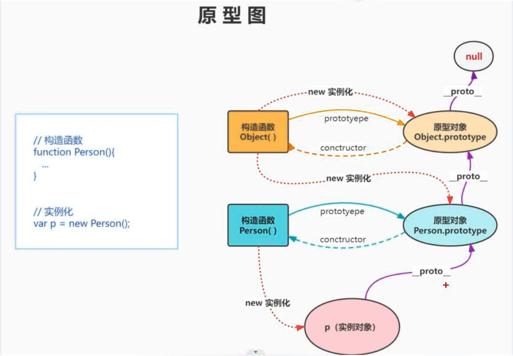
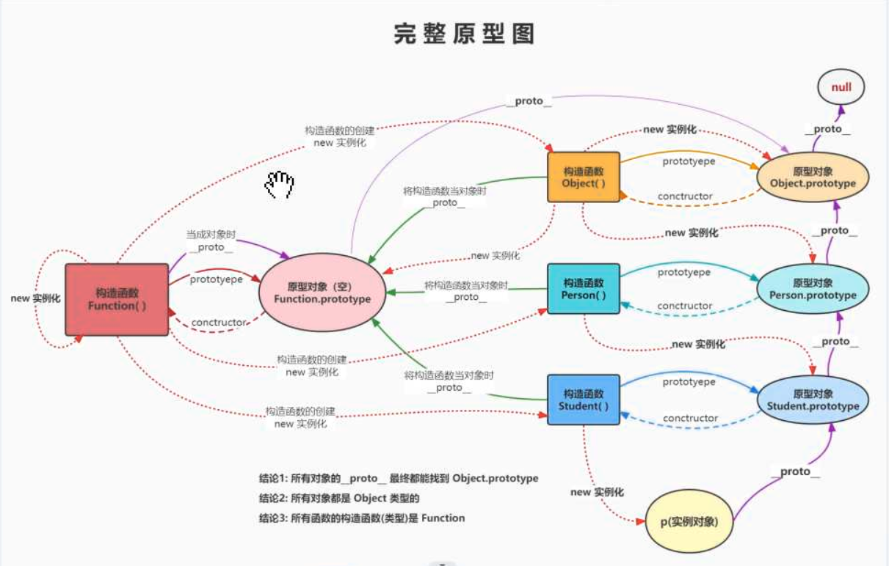
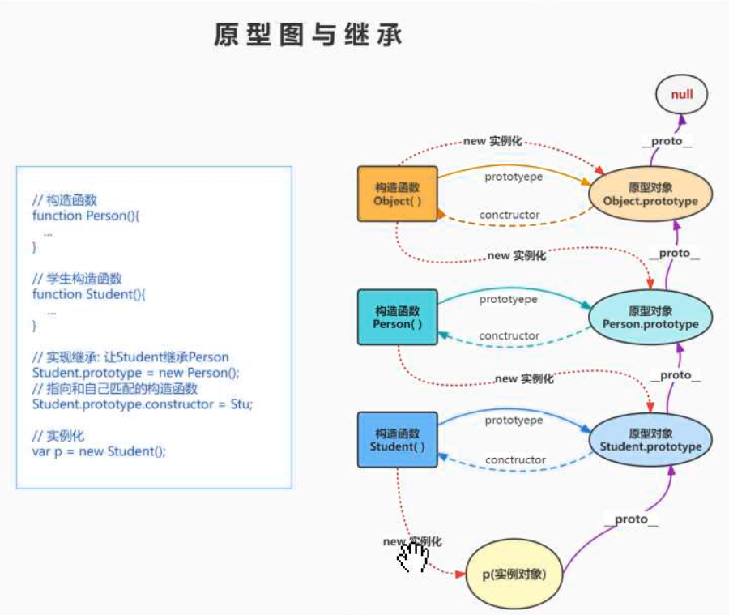

# JS高级

## 一、变量

### 1.1 定义

定义： 值可以被修改的量叫做`变量`，即存储数据的容器，本质是==内存空间==

面试题:

> **对象属性**的**赋值优先级**比变量**高**(==连等的情况下==)
>
> ```javascript
> var a ={
>   n : 1
> }
> var b =a;
> a.x = a ={
>   n:2
> }
> console.log(a.x); // undefined
> console.log(b.x); //{n:2}
> /*
>  a.x =a ={n:2} => 
>  a.x ={n:2};
>  a ={n:2};
> */
> ```
>
>  

### 1.2 变量的数据类型

* 基本数据类型
  * String  		字符串
  * Number         任意数值
  * Boolean         布尔值 true/false
  * Null                 空对象
  * undefined      未定义
  * symbol            ES6 常量 都是大写
    * PI			π
    * SORT_PRICE_UP
* 引用数据类型
  * Array	数组
  * Object     对象
  * Function  方法
  * Math        数学对象
  * RegExp    正则对象
  * Date         时间对象

### 1.3 数据存储

* 基本数据存储 数据本身 var a= 1
* 对象数据存储 地址值 var a = [1,2,3,4]
* PS:内存中存储的都是值，一个存的是数据本身，另一个存的是数据所在的内存地址

###1.4 数据类型转换

* 显示转换
  * 通过转换函数直接对数据进行转换


* 隐式转换   在运算中数据类型不统一时，会自动转成统一类型，然后进行计算

  * 布尔类型    [==以下情况为`假`==]

    * Number  ==0==  && ==NaN== =>`false`
    * String ==' '== =>`false`
    * Object ==null== => `false`
    * undefined => `false`

  * 数值 Number

    * 能转为 `true` ，否则为 `false`

  * 对象和数组的转换

    ```javascript
    console.log(String([10,20,30])); // '10,20,30'
    console.log(Number([10,20,30])); // NaN
    console.log(String({num:10}));//[object Object]
    console.log(Number({num:100})); // NaN

    console.log('abc'+{num:100});// abc[object Object]
    console.log('abc' - [10,20,30])//abc10,20,30
    console.log(20+{num:10})//20[object Object]
    console.log(20+[10,20,30])//2010,20,30

    console.log(20-{num:100})//NaN
    console.log(20-[10,20,30])//NaN
    ```

### 面试题

```javascript
//对象的判断
var b1 = {
  b2:[2,'test',console.log],
  b3:function(){
    alert('hello')
  }
}
console.log(b1,b1.b2,b1.b3);
//typeof 判断数据类型 针对引用数据类型除方法(function)外，都是object
console.log(b1 instanceof Object,typeof b1);//true 'object'
console.log(b1.b2 instanceof Array,typeof b1.b2);//true 'object'
console.log(b1.b3 instanceof Function,typeof b1.b3);//true 'function'
console.log(typeof b1.b2[2]);// function
console.log(typeof b1.b2[2]('test'));// undefined
```

* undefined 和 null 的区别
  * undefined代表定义变量没有赋值 var a
  * null 代表赋值了，但值为null var a =null
* 什么时候将变量赋值为null
  * 对象初始化 
    * var obj = null;
    * timer定时器初始化
  * 删除对象
    * obj = null => obj变为垃圾对象
    * document.onmousemove = document.onmouseup =null
  * 严格区分变量类型和数据类型
    * 在JavaScript中，变量类型是弱类型
    * 使用： =="use script"==


JS中的垃圾回收机制

​	原则：引用数据类型对应的数据源没有被引用

​	说明：在堆中查找数据源没有被引用的时候，对应数据源将被释放，即JS的垃圾回收

## 二、 对象

### 2.1 创建

* 利用字面量创建对象
* 利用new Object
* 利用构造函数创建对象

### 2.2 查看属性

```javascript
var name = 'name';
//查看
console.log(E.name)
console.log(E[name]);

console.log('user-class');

//属性遍历
for(key in E){
  console.log(key,E[key])
}
```

### ‘属性名’ in 对象 和 对象.hasOwnProperty(`'属性名'`)的区别

* for in 是判断当前对象是否包含自身 或 共有属性
* `Element`.hasOwnProperty()  用于判断对象是否包含自身属性
* 自身属性：定义的时候写入的属性
* 共有属性：[[property]]中包含的属性

## 三、函数

### 3.1 概念

​	具有特定功能的n条语句的封装体，只有函数是可执行的，其他类型的数据是不可执行的，函数也是对象

### 3.2 创建

* 具名函数(函数声明)

  * ```javascript
    function add(a,b){
      return a+b;
    }
    console.log(add(10,20));
    ```

* 匿名函数(函数表达式)

  * ```javascript
    var add = function(a,b){
      return a+b;
    }
    console.log(add(10,20));
    ```

* 使用Function构造函数进行创建

  * ```javascript
    var add = new Function('a','b','return a+b');
    console.log(add(100,200));
    ```

* 区分具名函数和匿名函数

  * 打印函数体
    * 有函数名的是具名函数
    * 没有函数名的是匿名函数

### 3.3 函数的两种角色

* 函数：通过`()`使用 ==》 函数
* 对象：通过`.` 使用 ==》 对象

### 3.4 回调函数

​	定义的，没有直接调用的，但最终执行了的函数

* 常见的回调函数:
  * DOM事件函数 Element.addEventListener('click',function(){})
  * 定时器函数
  * AJAX回调函数
  * 生命周期函数

### 3.5 数组方法（==new==）

* forEach();  数组遍历，且只能够遍历数组，`不接受返回值`或者返回值为`undefined`

  * ```javascript
    var arr =[1,3,5,2,3,5];
    //从数组中依次取出值
    arr.forEach((value)=>{
      console.log(value);
    })
    //从数组中依次取出下标和值
    arr.forEach((value,key)=>{
      console.log(key,value)
    })
    ```

* map()   数组遍历，用来接收一个返回值，创建一个`新的数组`，不改变原数组

  * ```javascript
    var arr = [1,2,3,4,5];
    var result =  arr.map((value)=>{
      return value;
    })
    console.log(result)
    ```

* filter()  过滤符合条件的元素，返回一个`新数组`

  * ```javascript
    var arr = [1,2,3,4,5];
    var result = arr.filter((itemd)=>{
      return item >=3;
    })
    console.log(result);
    ```

* some() 检测数组中是否含有某一个值，返回一个`布尔值`,如果数组中任意值符合条件，返回true

  * ```javascript
    var arr = [1,2,3,4];
    var result =arr.some((item)=>{
      if(item == 2) reutrn true;
    })
    console.log(result);
    ```

* every() 检测数组所有元素是否都符合指定条件,返回一个`布尔值`

  * ```javascript
    var arr =[10,11,12,13];
    var result = arr.every((item)=>{
      if(item>10) return true;
    })
    console.log(result)
    ```

* reduce() 对数组中的所有元素调用指定的回调函数，该回调函数的返回值为累计结果。并且把返回值在下一次回调函数时作为参数提供

  * 第一个参数是上一次回调函数的参数

  * ```javascript
    var arr = [1,2,3,4,5];
    var result =arr.reduce((prev,value)={
      console.log(prev,value);
      return prev*value;
    },1)
    //数组arr的元素的阶乘
    ```


上述方法的小结：

| 方法        | 说明                           | 返回值            |
| --------- | ---------------------------- | -------------- |
| forEach() | 数组元素遍历                       | 没有 或 undefined |
| map()     | 数组遍历，并返回一个新数组                | Array          |
| filter()  | 过滤符合条件的数据                    | Array          |
| some()    | 判断是否存在某一个值                   | Boolean        |
| every()   | 判断数组元素是否全部符合某个条件             | Boolean        |
| sort()    | 对数组中的元素进行排序(默认根据ASCII码值进行排序) | Boolean        |
| reduce()  | 将数组中所有元素代入回调函数               | 回调函数中的return   |


| 对原数组有影响的方法                               | 对原数组没有影响的方法                              |
| ---------------------------------------- | ---------------------------------------- |
| push、pop、unshift、shift、splice、reverse、sort | join、concat、slice、valueof、toString、forEach、map、filter、some、every、reduce |


### 3.6 闭包

#### (1)、概念

​	有权访问另一个函数作用域中的变量的函数

​	即在函数中返回一个函数

#### (2)、原理

​	作用域链：当前作用域可以访问上级作用域中的变量

#### (3)、解决&带来的问题

* 解决的问题
  * 能够让函数作用域中的变量在函数执行结束后不被销毁
  * 同时也能在函数外部可以访问函数内部的函数变量
* 带来的问题
  * 由于垃圾回收器不会将闭包中的闭包销毁，会造成内存泄露，容易导致内存泄露
  * 可以通过对闭包赋值为null，让垃圾回收器回收

#### (4) 、闭包的作用

* 延迟变量的生命周期
* 创建出私有作用域（如Vue中data返回一个对象）
* 闭包可以在函数外部访问到函数内部作用域的变量
  * 闭包可以让访问变量不会被垃圾回收机制回收

#### (5)、实现

* 在外部函数内定义一个内部函数
* 在内部函数中引用外部函数的局部变量
* 外部函数返回内部函数的函数体
* 外部函数和内部函数都要执行


```javascript
//需求: 为函数添加一个计数器，用于统计此函数的调用次数
function counter(){
  var count = 0;
  return ()=>{
    count++;
    return count;
  }
}
```

### 3.7 call、apply 和 bind

用于对象借用其他对象所拥有的方法

其他对象.方法名.call(`要借用方法的对象`,`传递参数`)

其他对象.方法名.apply(`要借用方法的对象`,`[传递参数]`)

其他对象.方法名.bind（`借用方法的对象`,`传递参数`）

call()和apply()在定义之后立即执行

call()和bind()传递参数需要一个一个参数进行传递

### 3.8 变量的作用域

概念： 变量在程序中可以访问的有效范围，又称变量的可见性

变量分为全局变量和局部变量：

​	全局变量： 变量在整个页面都是可见的，可以被自由的访问，在函数之外定义的变量

​	局部变量：变量仅能在声明的函数内部可见，函数外是不允许访问的。

### 3.9 执行上下文、执行上下文栈

执行上下文：程序在解析的时候所依赖和使用的环境

​	全局执行上下文环境

​	函数执行上下文环境

执行上下文栈： 程序为了管理执行上下文所创建的一个栈数据结构

作用域链： 使用执行上下文中变量对象组成的链条结构（数组结构）

* 函数重名会覆盖，变量重名会忽略

* **[special]** 匿名函数的预解析

  * ```javascript
    a();
    function a(){
      console.log('aaa');
    }
    var a = function(){
      consoel.log('bbb');
    }
    a();
    /*
    	预解析
    function a(){
      	console.log('aaa');
    }
    a();
    a = function(){
    	console.log('bbb');
    }
    a();
    */
    ```

### 3.10 原型对象

#### (1) 显示原型对象

​	任何==函数==中存在一个属性：`prototype`，这个属性的属性值即原型对象

​	在原型对象中，有一个属性：`constructor`指向当前函数

#### (2) 隐式原型对象

​	任何==对象==都有有一个属性:`__proto__`，代表的是此对象的原型对象

​	它和函数对象prototype地址一样，代表同一个对象

#### (3) 原型链

* 描述的是对象在查找属性或方法的过程

  * 实例化对象在找属性的时候先从自身找看有没有这个属性，如果有，直接使用这个属性的值
  * 如果没有，会顺着这个对象的隐式原型对象`(__proto__)`找到这个对象的原型对象（和它的构造函数的显示原型对象是同一个），看看原型对象是否存在这个属性，如果有就使用原型对象当中的这个属性值
  * 如果仍然没有，再去找原型对象的隐式原型对象（默认是`Object`显示原型对象），找到后去看看有没有这个属性，有的话使用
  * 通过上述过程仍然没有的话，属性值为undefined （已经找到顶了）

* 当创建一个函数的时候，JavaScript引擎会自行执行以下代码：

  * ```javascript
    //function Person(){};

    //以下代码

    Person.prototype = new Object;
    Person.prototype.constructor = Person;

    ```




#### (4) 终极原型链



### 3.11 面向对象

#### (1) 封装

​	功能代码使用函数声明包起来，即函数的封装

#### (2) 继承



* 原型继承

  * ```javascript
    //父类
    function Dog(name,age){    
      this.name = name;    
      this.age = age;
    }
    //子类
    function Teddy(name,age){
      this.name = name;    
      this.age = age;}
    Dog.prototype.run = function(){    
      console.log('跑的很快~');
    }
    //为了让子类去继承父类原型当中的方法
    //我们需要用到原型继承，原型继承主要就是为了让子类继承方法使用的
    //让子类的原型变成父类的一个实例
    Teddy.prototype = new Dog();
    // 手动给原型对象添加一个构造器，因为原型对象里面都是有构造器的
    // 指向和自己匹配的构造函数
    Teddy.prototype.constructor = Teddy;
    var d1 = new Dog('旺财',3);
    d1.run();
    var t1 = new Teddy('小黑',2);
    t1.run(10);
    ```

  * ​

#### (3) 多态

​	同样的构造函数在创建后的表现形式不是只有一个样式，其有多个表现形式

### 3.12 Web Workers

**注意:**`此功能实现必须在服务器端实现，否则将会报错`

在JavaScript中，可以进行多线程实现

```javascript
//主线程
var worker1 = new Worker('子线程文件路径');
//主线程向子线程发送信息
worker1.postMessage('Hello!');
//主线程接收信息
worker.onmessage = (e)=>{
  //从事件对象中获取传过来的信息
  console.log(e.data)
}
```


```javascript
//子线程
//接收信息
self.onmessage = function(e){
  //接收到的消息或者数据在事件对象的data属性当中				
  console.log(e.data)			
}
//向主线程发送信息
self.postMessage('分线程->主线程')

```


###[Extra]进制

| 转换关键字 | 说明          |
| ----- | ----------- |
| 0b    | 二进制 ->十进制   |
| 0o    | 八进制 -> 十进制  |
| 0x    | 十六进制 -> 十进制 |


## 经验之谈

*  在写函数的时候，尽量避免使用全局变量，减少参数依赖
*  一个文件写渲染，一个文件写验证，一个文件写特效
*  注意数据渲染和SEO优化之间的取舍
*  某个元素图层固定在所有内容之上的时候，其元素父级为body
*  程序开发是不可逆的
   *  项目一旦开工，最终时间是固定的