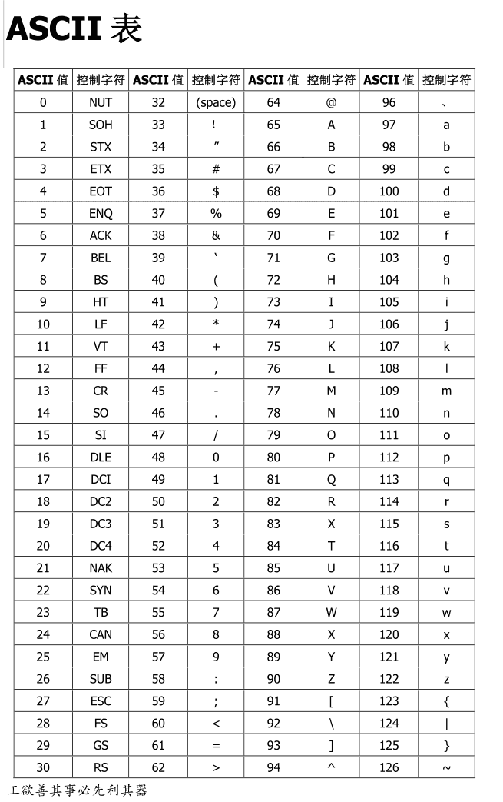
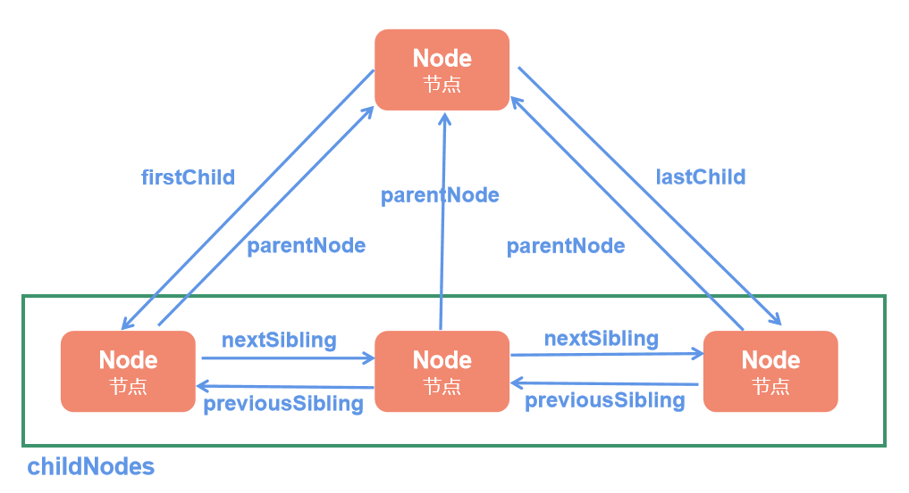
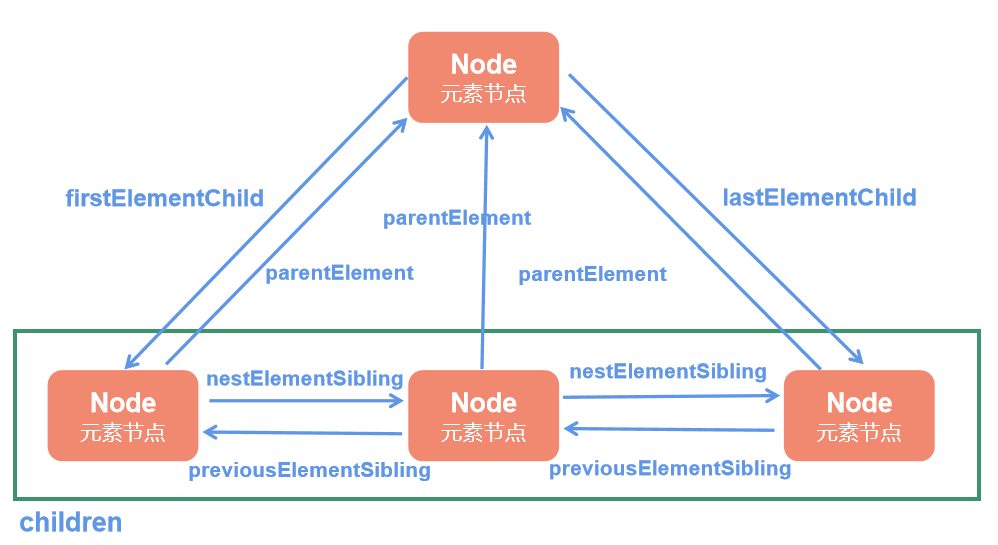

#  JavaScript 

##  一、JavaScript概况

> JavaScript(JS),是一种可以跨平台的脚本语言
>
> 脚本语言：可以嵌套到其他程序的一种语言

###  1.1 JavaScript的功能

* 实现页面数据动态化
* 实现用户和网页的交互
* 写后台Node

###  1.2 JS的组成部分

* ECMAscript （ES）基础语法
* DOM（Document Object Model）文档对象模型
* BOM（Browser Object Model）浏览器对象模型

###  1.3 JavaScript书写位置

 * 行内 JS

> 利用onclick属性
>
> ​	onclick绑定方法名
>
> ```html
> <button onclick="alert('这是一个按钮')">这是一个按钮</button>
> ```
>
> 

* 内部 JS

> 使用`<script></script>`包括
>
> 一般是放在整个文件最后，即把网页结果写完后在进行引用

* 外部 JS

> 使用`<script src='js文件地址'></script>`引用
>
> 在标签内部不能填充内容

### 1.4 JavaScript的输出方式

> **JavaScript代码书写须知**
>
> 1. JavaScript语法严格区分大小写
> 2. 所有的标点符号都必须是英文
> 3. JavaScript代码从上往下依次执行，有错误后面的代码都不执行
> 4. JavaScript注释
>
>   ​单行注释 Ctrl+/		//
>
>   ​多行注释 Shift + Alt +a /**/
>
> 5. 写完一行代码后以 ; 结尾

接下来对JavaScript的输出方式进行说明

- 直接输出 document.write()

```JavaScript
document.write("这里写字符串");			//输出字符串
document.write(1+1);					//输出数字
document.write("<p>这是输出标签</p>")		//输出标签
```

> 除非写数字，否则输出内容必须使用引号包裹
>
> **使用频率较高的为console.log()，但具体使用什么看自己的习惯** 

* 弹窗输出		alert()

```javascript
alert("弹窗里的内容");					//输出字符串
```

* 控制台输出	console.log()

```javascript
console.log('控制板输出的内容');			//输出字符串
console.log(1+1);						 //输出数字
```

****

## 二、JavaScript基础

### 2.1变量

> 可以变化的量，进行数据存储

#### 2.1.1定义/声明变量

> 以下是对变量的基础定义
>
>   var          a     = ’内容‘；
>
> 关键字 变量名 = 变量值 ;

#### 2.1.2变量的赋值

> a = '新内容'；
>
> 之前已经定义过的变量 = '变量的内容'

#### 2.1.3变量名的命名规则

> 1. 由字母、数字、下划线和$组成
> 2. 变量不能以数字开头
> 3. 不能使用关键字和保留字进行变量的定义
>
> **关键字**
>
> ```
> break，else，new，var， case，  finally ， return， void ， catch  ，for  ，switch ， while ， continue，  function  ，this ， with ，default ， if ， throw ， delete ， in ，  try ，do ， instranceof，  typeof
> ```
>
> **保留字**
>
> ```
> abstract ， enum   ，int ， short ， boolean  ，export  ，interface，  static，  byte  ，extends ， long ， super ， char ， final  ，native  ，synchronized ， class  ，float ， package  ，throws ， const  ，goto  ，private ，transient ， debugger ， implements  ，protected ， volatile ， double  ，import  ，public
> ```
>
> 4. 变量名一般不能重复
> 5. 名字需要见名知意
>
> **驼峰法**
>
> ​	驼峰法包括小驼峰法和大驼峰法
>
> | 方法   | 说明                  | 示例          |
> | ---- | ------------------- | ----------- |
> | 小驼峰法 | 首个单词首字母小写，后续单词首字母大写 | numberCount |
> | 大驼峰法 | 所有单词首字母大写           | NumberCount |


undefined 未定义		定义过的变量但没有值

### 2.2 数据类型

* 基本数据类型

|  数据类型   |   英文    | 值            |
| :-----: | :-----: | :----------- |
|   字符串   | String  | 用''或者“”包裹的内容 |
|   数字    | Number  | 数字           |
|   布尔值   | Boolean | true/false   |
|   空对象   |         | null         |
| **特殊值** |         | **值**        |
|   非数值   |         | NaN          |
|   未定义   |         | undefined    |

* 复杂数据类型/引用数据类型/`对象`数据类型

| 数据类型 | 英文       |
| ---- | -------- |
| 函数   | function |
| 数组   | Array    |
| 对象   | Object   |

数组 ： 批量存储多个同种类型的数据

函数 ： 包裹功能代码

对象 ： 主要描述具体的人或事物

* 字符串

  ```javascript
  var String = '这是字符串'；
  var doubleIncludeSingel ="这是双引号'包含'单引号"
  var SingleIncludeDouble = '这是单引号"包含"双引号'
  ```

* 数字

  ```javascript
  var Number =1;			//这是数字
  ```

* 布尔值

  ```javascript
  var BooleanF = false;		//这是布尔值 假
  var BooleanT = true ;		//这是布尔值 真
  ```

* 未定义

  ```javascript
  // 未定义一般情况下是声明了变量但是没有给其赋值
  var a;
  console.log(a);//输出undefined
  ```

* 空对象

  ```javascript
  var Null = '';
  ```

#### 2.2.1判断数据类型

* **typeof**

  ```javascript
  //用来判断对应内容的数据类型，以下声明一些特殊的typeof值
  typeof null;		//object
  typeof NaN;			//number
  typeof undefined;	//undefined
  ```

### 2.3 数据运算

#### 2.3.1 数据的算数运算

> 运算符	参与运算的符号
>
> 表达式	数据和运算符组成的式子，且表达式一定有值

| 符号   | 含义     |
| ---- | ------ |
| +    | 加      |
| -    | 减      |
| *    | 乘      |
| /    | 除      |
| %    | 取余数（模） |
| ++   | 自增     |
| --   | 自减     |

##### （1）自增和自减

​	上面定义的算数运算算是基础的，但是自增和自减不在常规的数学计算中，在这里简单说明下他们。

```javascript
//先设定一个初始值
var a = 1;
a++;	//在a计算之后a+1
console.log(a);		// a = 2		
++a;	//在a计算之前a+1
console.log(a);		// a = 3
//当自增运算符对应的表达式独立执行的时候，++的前后顺序不影响计算结果
a--;	//在a计算之后a-1；
console.log(a);		// a = 2
--a;	//在a计算之前a-1;
console.lgo(a);		// a = 1
//注意在表达式计算的时候，注意相关值的自增和自减
var b = 3 + a++;	// a=2 b=5
var c = 2 + a--;	// a=1 c=3
var d = 1 + ++a;	// a=2 d=3
var f = 2 + --a;	// a=1 f=3
```

| 表达式  |    含义    | a的值  |
| :--: | :------: | :--: |
| a++  | 在a计算后a+1 |  2   |
| a--  | 在a计算后a-1 |  0   |
| ++a  | 在a计算前a+1 |  2   |
| --a  | 在a计算前a-1 |  0   |

​	**以上表格中，a的初始值为1**

##### （2）非数字的运算

* 字符串之间的算数运算

  ```javascript
  var a ='嘿嘿'；
  var b ='哈哈';
  console.log(a+b);	//字符串拼接
  console.log(a-b);	//NaN	非数值
  console.log('a'+1);	//a1
  console.log(a*b);	//NaN
  console.log(a/b);	//NaN
  ```

  * **`+ ` 的作用**
    1. 做计算	`+` 两侧都是数字

    2. 做字符串拼接  `+` 的一侧出现字符串

    3. 将数据转化成数字,转化规则同Number()

       > +"数据"

  以下内容需要格外注意：

  * **存在`''`和`""`包围数字的时候，除了加法，其余计算方式都会对数字进行字符类型转换**
  * **布尔值进行计算的时候，`true` =`1` ，`false` =` 0`**


  * **所有和`undefined`进行算数运算的时候，结果都是`NaN`**
  * **`null`进行算数运算的时候，被视为0，但在`/`和`%`计算的时候，结果都是`NaN`**
  * **`NaN` 进行任何算数运算结果都是`NaN`，除了拼接字符串**

#### 2.3.2 数据的赋值运算

​	以下是常见的赋值运算符

|  符号  |         说明          |
| :--: | :-----------------: |
|  =   |         赋值          |
|  +=  |   a+=1 => a = a+1   |
|  -=  |  a -= 1 => a = a-1  |
|  *=  | a *= 1 => a = a * 1 |
|  /=  | a /= 1 => a = a / 1 |
|  %=  | a %= 1 => a = a % 1 |

#### 2.3.3 数据的比较运算

​	以下是一般的比较运算符 \[关系运算符]

| 名称   | 符号   | 备注       |
| ---- | ---- | -------- |
| 大于   | >    |          |
| 小于   | <    |          |
| 大于等于 | >=   |          |
| 小于等于 | <=   |          |
| 等于   | ==   | 值对比      |
| 等于   | ===  | 值、数据类型对比 |
| 不等于  | !=   | 值对比      |
| 不等于  | !==  | 值、数据类型对比 |

​	在进行比较的时候，如果在比较运算符两侧都出现了字符串，将把字符串的内容转化为ASCII值

	

小写字母 `97`-`122`

大写字母	`65`-`90`

数字	`48`-`57`

​	出现多个字符串内容进行大小比较的话，从左向右进行比较，表值相同继续向后比较，否则结束比较，输出比较结果。

```javascript
'a'>'b';	//false	a(97)<b(98)
'ab'>'bz';	//false a(97)<b(98)
5>'123';	//false	这种情况直接进行值的比较
'abc'<123;	//false	数值和非数值进行比较结果固定为false
```

​	以下给出一些`==`和`===`的特殊值：

```javascript
console.log(true == 1);//true
console.log(null == 0);//false
console.log(true === 1);//false
console.log(undefined == null);//true 
console.log(undefined === null);//false
```


#### 2.3.4 数据的逻辑运算符号

| 名称   | 符号   | 备注                      |
| ---- | ---- | ----------------------- |
| 逻辑与  | &&   | 都满足才是true               |
| 逻辑或  | \|\| | 有一个满足就算true             |
| 取反   | ！    | true=》false；false=》true |

### 2.4 数据转换

#### 2.4.1 其他类型转数字

##### （1）Number（）

> 当转化内容存在非数字的时候，无法转化，并输出NaN
>
> 空串`''`和空白串`' '`转化为0
>
> 纯数字文本串前或后存在空格的时候，可以正常转化为数字
>
> 纯数字文本之间存在空格，视为普通文本串

* 布尔值转化为数字

  > true => 1
  >
  > false => 0

* undefined转数字

  > 输出NaN

* null转数字

  > 输出为0

##### （2）取整 parseInt()

​	可以转化为没有小数点后的数字

​	在转化过程中，只要存在非数字，非数字后面的内容将不进行转化，如果非数字内容在首位的话，则输出`NaN`

##### （3）取浮点数 parseFloat()

​	可以转化为带小数点后数字的数字

​	转化过程同parseInt()，转化过程遇见非数字则后面的内容不进行转化

##### （4） +

​	直接在数据前加一个`+`

```javascript
var receiveData = +prompt('这里是接收到的数据');
```

#### 2.4.2 其他类型转字符串

​	**String()**

​	转化不忌，内容全部转化

#### 2.4.3 其他类型转布尔值 

​	**Boolean()**

​	除了`空串（''）`外，其余所有字符串都会转化为`true`

​	数字除了`0`外，其余都是`true`

​	`undefined`和`null`转化布尔值都是false

#### 2.4.4 隐式转换

​	在进行算数运算的时候，存在算术运算符的时候，会对其他类型的数据进行转换成数字类型，这一过程是浏览器自行操作的。这个操作叫做**隐式转换** 。

### 2.5 短路问题

​	正常情况，逻辑运算符两侧链接的都是关系表达式，整个逻辑表达式最终一定会得到一个布尔值。

​	逻辑运算符号有的时候两侧不是关系表达式，而是一个具体的值的时候。以下简单记录下在这种情况下的运行。

```javascript
//短路与
console.log(1 && 2);
/*
	Boolean(1)	->	true
	此时的状态是： true&&2
	输出结果是		2
*/
console.log(0 && 2); //Boolean(0) --false
```

​	如果一侧得不到布尔值的话，需要使用`Boolean()`方法区转化为布尔值。这个过程是浏览器自行使用的。

​	如果`&&`运算符`左`侧为`true`的话，直接返回`右侧的值`

​	如果`&&`运算符`左`侧为`false`的话，直接返回`左侧的值`

```javascript
//短路或
console.log(1 || 2);
/*
	Boolean(1) 	->	true
	此时的状态是		1 || 2
	输出结果是		1
*/
```

​	如果`||`运算符`左`侧为`true`的话，直接返回`左侧的值`

​	如果`||`运算符`左`侧为`false`的话，直接返回`右侧的值`

### 2.6 运算符的优先级

| 优先级  | 运算符   | 具体                     |
| :--: | ----- | ---------------------- |
|  1   | 括号    | `(`,`)`                |
|  2   | 一元运算符 | `++`,`--`,`!`          |
|  3   | 二元运算符 | `*`,`/`,`%`            |
|  4   | 二元运算符 | `+`,`-`                |
|  5   | 关系运算符 | `>`,`<`,`>=`,`<=`      |
|  6   | 比较    | `==`,`===`,`!=`,`!==`  |
|  7   | 逻辑运算符 | `&&`                   |
|  8   | 逻辑运算符 | `||`                   |
|  9   | 三元运算符 | 条件`?`true的值 `:`false的值 |

### 2.7 流程控制语句

#### 2.7.1 逻辑分支

##### (1)  if语句

```javascript
if(/*表达式*/){
  //符合表达式	执行语句
}else{
   //不符合表达式	执行语句
}
```

##### (2) else if语句

```javascript
if(/*表达式*/){
  //符合表达式	执行语句
}else if(/*另一个表达式*/){
  //符合else if上的表达式
}else{
  //不符合上面的表达式	执行语句
}
```

​	**else if 语句可以有多次**

##### (3) 三元运算符/三目运算符

* 一目运算表达式

  ​	只有一个操作数

  > a++
  >
  > --a

* 双目运算表达式

  ​	有两个操作数 

  > a+b;
  >
  > a-b;

* 三目运算表达式

  ​	**表达式1 ? 表达式2 : 表达式3**

  > 1>2?'true':'false'


##### (4) switch case语句

```javascript
var num = 1;//固定设置一个值
switch(num){//进行声明
  case 1:
    console.log('num'=num);//执行语句， num =1 的执行语句
    break;//跳出当前循环,如果不加的话，下面的执行语句都会执行
  case 2:
    //执行语句2
    break;
  case 3:
    //执行语句3
    break;
  default:
    //以上条件都不满足执行语句
}
```

​	**switch的判断是严格判断，即case的值必须完全等于条件值，否则响应的语句不会执行**

​	**break加上后会强制结束判断语句，不加的话会依次执行后续书写的所有执行语句**

#### 2.7.2 循环语句

​	**循环：重复的干同一样事情**

​	**死循环：当条件一直满足的时候，循环体一直执行**

​	**边界表达式：循环的时候让循环语句有一定的执行次数的表达式**

##### (1) while循环

```javascript
while(/*边界表达式*/){
   //满足条件时完成的语句
} 
```

##### (2) do while 循环

```JavaScript
do{
  //循环的语句
}while(/*边界表达式*/)
```

​	**do while语句只执行一次**

##### (3) for循环

```JavaScript
for(/*初始条件*/;/*边界表达式*/;/*执行完一次循环语句后执行表达式*/){
  //执行语句
}
```

**for循环命名习惯**

​	一般情况下，for循环内部的变量名为`i`,`j`,`k`,`m`,`n`

##### (4) 循环中的关键字

* break

  跳湖自己所在的循环，后面的代码不执行，后面的循环也不执行

* continue

  跳出本层循环，之后的代码不执行，但是循环依然执行


### 2.8 复杂的数据类型

​	前面介绍了许多数据类型，但仍有些较为复杂的数据类型：

* 数组	Array
* 函数         function
* 对象         Object

#### 2.8.1 数组

​	概念：由多个相同或者不同的数据类型组成的有序集合

​	作用：批量存储数据

#####  (1) 数组的定义

```JavaScript
//1. 字面量定义
var arr=[1，2，3];
//这里存储的基本是 基本数据类型 的数据
var arr2 = [];

//2. 构造函数
var arr3= new Array(/*多个数据的集合，使用 ， 隔开*/1，2，3);
//如果使用这种方法Array（）内只有一个数字的时候，是定义数组的长度为数字值
```

**无论数组还是函数，本质都是对象**

> typeof arr  =>   Object
>
> function act(){}
>
> typeof act => Object

#####(2) 数组内容的获取

​	**数组名[下标]**

​	下标：给数据内存储的数据做的一个标记，从0开始计数

​	元素：数组中的每一项数据

​	数组的长度：一个数组中元素的个数

​	数组的遍历：获取数组中所有的数据

```javascript
var arr =[1,2,3,4,5]
//获取数组的长度	数组名.length
console.log(arr.length);//arr的长度
//获取某个数据	数组名[下标]
//获取第二项数据 利用下标进行获取数据
console.log(arr[1]);

```

> 1 当数组的下标对应的数据不存在的时候，取值时会报出undefined

##### (3) 数组元素的添加

* 头部添加数组元素

  ```javascript
  var arr = [1,2,3,4,5];
  for(let i=arr.length-1;i>=0;i--){
    arr[i+1]=arr[i];//元素的转移
  }
  arr[0]=0;//进行头部元素的赋值
  ```

* 任意位置添加数组元素

  ```javascript
  var arr = [1,2,3,4,5];
  for(let i = arr.length;i>3;i--){
    arr[i+1]=arr[i];
  }
  arr[3]=3.5;
  ```

* 数组末尾添加数组元素

  ```javascript
  var arr = [1,2,3,4,5];
  arr.[arr.length]='要添加的值'；
  ```

##### (4) 数组元素的删除

* 头部删除数组元素

  ```javascript
  var arr = [1,2,3,4,5];
  for(let i =0;i<arr.length-1;i++){
    arr[i]=arr[i+1];
  }
  arr.length--;
  //另一种方法
  for(let =1;i<arr.length;i++){
    arr[i-1]=arr[i];
  }
  arr.length--;
  ```

* 任意位置删除元素

  ```javascript
  var arr =[0,1,2,3,4,5];
  for(let i =0/*想要删除数据的下标*/;i<arr.length;i++){
    arr[i]=arr[i+1];
  }
  arr.length--;
  ```

* 数组尾部删除数组元素

  ```javascript
  var arr =[1,2,3];
  arr.length--;
  ```

##### (5) 数组经典案例

* 反转 存到新数组

  ```javascript
  var arr=[1,2,3,4,5];
  var newArr=[];
  for(let i=arr.lengh-1;i>=0;i--){
    newArr[newArr.length]=arr[i];
  }
  ```

* 反转 直接影响原数组

  ```javascript
  var arr = [1,2,3,4,5];
  for(let i=0;i<arr.length/2;i++){
    var temp ='';
    temp = arr[i];
    arr[i] = arr[arr.length-1-i];
    arr[arr.length-1-i] =temp;
  }
  ```

* 数组去重

  ```javascript
  var arr = [1,3,4,52,2,3,5];
  var newArr = [];
  //计数器方法
  for(let i =0;i<arr.length;i++){//数组内元素的遍历
    var count =0;
    for(let j=0;j<newArr.length;j++){
      if(arr[i] != newArr[j]){
        count++;
      }
    }
    if(count == newArr.length){
      newArr[newArr.length] = arr[i];
    }
  }

  //另一种方法 flag法
  for(i = 0; i<arr.length;i++){
    var flag =false;
    for(var j= 0;j<newArr.length;j++){
      if(arr[i] == newArr[j]){
        flag = true;
        break;
      }
    }
    if(flag == false){
      newArr[newArr.length]=arr[i];
    }
  }

  ```

* 冒泡排序

  数组中元素两两比较，符合规则进行位置交换

  ```javascript
  //乱序数据进行排序
  // 从小到大排序
  var arr =[5,2,4,3,1];
  for(let i = 1;i<arr.length;i++){
    for(var j=0;j<arr.length-i;j++){
      if(arr[j]>arr[j+1]){
        var temp = arr[j];
        arr[j] = arr[j+1];
        arr[j+1] = temp;
      }
    }
  }

  //另一种方法 【边界条件不同】，其余思路一致
  var arr = [2,5,3,1,4];
  for(var i =1;i<arr.length;i++){
    for(var j =0;j<arr.length-1;j++){
      if(arr[j]>arr[j+1]){
        var temp = arr[j];
        arr[j] = arr[j+1];
        arr[j+1] = temp;
      }
    }
  }
  ```

##### (6) 多维数组

```javascript
var arr = [
  '数据1',
  '数据2',
  [
    '子数组1',
    '子数组2'
  ]
];
//获取数组中的数组
var childArr = arr[2];
var childArr_1 = arr[2][1];
```

基础就是这样，对于更复杂的多维数组（数组套数组）根据文件路径找对应的值。

#### 2.8.2 函数【基础】

##### (1) 函数的基础 

###### 1. 函数的声明

* 通过字面量定义函数**[常用]**

  **本质是构造函数**

  ```javascript
  function 函数名(){
    函数体
  }
  ```

* 定义表达式定义函数**[少用]**

  ```javascript
  var 变量名 = function (){
    函数体
  }
  ```

* 通过构造函数**[基本不用]**

  ```javascript
  var funtion_letter_create = new Function('
    函数体
  ')
  ```

  **函数体**就是功能的代码，构造一个函数就是对函数体进行**封装**

###### 2. 函数的使用

```javascript
	函数名();
//如果有参数的话
	函数名(参数1，参数2);
```

* 函数三要素
  * 函数的功能 一般情况下看函数名，实际上是看函数体，函数名减少代码阅读门槛
  * 函数参数     可有可无的
    * 多个函数功能类似可以将变化的东西交给参数处理
    * 实参：函数调用时传递的数据
    * 形参：函数定义的时候接收的参数
      * 形参的值一定是从实参接收到的参数
      * 形参的本质是在函数内部定义了一个变量
      * 形参没有接收到值的时候，相当于该变量只进行定义，没有对其赋值，
  * 函数返回值 可有可无的
    * 函数`return`的值，函数执行后的结果就是那个值
    * `return`后面什么值也没有写的话，函数执行之后的结果就是`undefined`
    * 如果练`return`都没写的话，函数执行后的结果是`undefined`
    * `return`后面的代码不会执行，函数会立即结束

###### 3. 函数的作用

* 提高代码的复用性
* 减少代码冗余
* 提高代码的独立性

###### 4. 函数的参数

​	在函数声明的时候在括号内写出需要传递进函数的变量

```javascript
function add(a,b){//形参 a，b
  //计算a+b
  console.log(a+b)
}
add(num1,num2);//实参 num1 num2
```

​	写进函数定义的括号内的变量为`形参`

​	**形参和实参的名字可以重复**

* 正常情况下，形参和实参的数量是对等的，但有一些意外：
  * 形参比实参多		没有接收到数据的形参打印结果为undefined
  * 形参比实参少         形参从`左`到`右`依次接收值，没有接收到的参数在使用的时候会**报错**

###### 5. 函数的返回值

使用目标：

* 返回函数执行的结果

  ​使用`return`关键字，跟随需要返回的数据对应的表达式

```javascript
function test(){
  return 1;
}
test();// 结果为 1

var b =test();
b();
```

* 如果打印函数调用之后的结果，return后的值是什么，输出什么结果

* 如果函数只有`return`关键字而不跟返回值，其值为undefined

* 一个函数的return只有一个值，这个值：

  * 一个字符串

  * 一个数字

  * 一个数组

  * 一个对象

    这个值完全是自己定义的

##### (2) 函数的分类

###### 1. 函数的定义

* 官方函数		官方已经定义过的函数
* 自定义函数      用户自行定义的函数

###### 2. 以函数样式的分类

* 普通函数		正常的函数
* 构造函数         new 关键字

###### 3. 以参数和返回值进行分类 

* 无参无返回值函数
* 无参有返回值函数
* 有参无返回值函数
* 有参有返回值

##### (3) 作用域

​	概念： `变量`的**作用范围**

​	分类：当函数在定义的时候，就已经将作用域划分出来

​			1 全局作用域   函数名及之外的所有区域

​			2 局部作用域   形参和花括号中的区域

* 作用域链    变量的查找规则

  ​	变量在查询自己值的时候，会依次从里向外找，先找到哪个，值就是哪个，如果全局变量中也找不到对应的值的时候，进行报错。

##### (4) 全局变量和局部变量

​	`全局变量`：定义在全局作用域中的变量

​				在局部作用域中，如果变量声明没有`var`关键字，也是全局变量

​	`局部变量`：定义在局部作用域中的变量

​				形参也属于局部变量

* 全局变量的特点
  * 任何作用域都可以访问到这个值
  * 在全局变量名重复的时候，后面值会覆盖前面的值
* 局部变量的特点
  * 只有在局部作用域才可以获取局部变量

##### (5) JavaScript的预解析

**JavaScript代码的执行步骤：**

* 预解析

  * 函数提升

    ​	将函数定义的整个代码块提升到当前作用域的顶部，

  * 变量提升

    ​	将var 和变量名一起提升到当前作用域的顶部，值不会进行提升

* 从上往下执行

**JavaScript预解析的特殊情况**

* 表达式函数的提升

  ```javascript
  fn();//报错
  var fn = function(){
    console.log(1);
  }

  //以上代码预解析的时候成果
  var fn;
  fn();//在调用的时候fn还没有被赋值，此时只是一个普通的变量
  fn = function(){
    console.log(1);
  }
  ```

* 不带var的变量不进行提升

  ```javascript
  console.log(a);//a is not defined
  a =1;//
  console.log(a);
  ```

* 局部作用域中的变量提升，不带var不提升

  ```javascript
  function fn1(){
    console.log(a,b,c);//undefined ,undefined, c is not defined
    var a= 1;
    var b =2;
    c =3;
    console.log(a,b,c);
  }
  ```

* 函数名重复，以最后函数为准

  ```javascript
  fn1();
  function fn1(){
    console.log(1);
  }
  function fn1(){
    console.log(1);
  }
  function fn1(){
    console.log(1);
  }
  //后定义的会覆盖前面定义的
  ```

* 函数名和变量名重复，变量名提升会被忽略

  ```javascript
  console.log(fn1);
  function fn1(){
    console.log(1);
  }
  fn1();
  var fn1 = 123;
  console.log(fn1);
  ```

  函数提升优先于变量的提升

##### (6) 函数补充（高级）

* 不使用形参接收实参的值

  ```javascript
  function fn1(){
    console.log(arguments[0]+'今年'+arguments[0]+'岁');
  }
  fn1('名字',18);
  //arguments 伪数组 存储实参传入的值 
  //arguments.callee 函数体
  ```

* 立即执行函数

  * 匿名
  * 直接自己调用
  * 只能调用一次

  ```javascript\
  (function(){
    函数体
  })();
  ```

  书写要求：每个匿名函数结束后必须添加 `;` 否则会影响后面的代码的执行

  匿名函数整体不会**预解析**，但内部是会进行预解析的

* 回调函数

  回调函数的特点：

  * 函数是自行定义的
  * 没有调用函数
  * 函数执行

  常见的回调函数

  * 和时间联系的函数
  * 和定时器联用的函数
  * 和后端请求相关的AJAX联用的函数
  * 生命周期函数(框架相关)

* 递归函数

  自己调用自己的函数

  ```javascript
  // 1-5 的累加和
  function add(num){
    return num + num(num-1);
    if(num == 1){
      return 1;
    }
  }
  add(5);
  ```

  错误的递归会陷入死循环

#### 2.8.3 对象

##### (1) 定义对象

* 字面量

```javascript
var 对象名 = {
  属性名:属性值， //键值对
  属性名：属性值
}

//例子
var obj = {
  name : 'test',
  sex  : 'female',
  art  : 'sing',
  hobby : ['sing','dance','rap']
}
```

> 属性名（键名）
>
> ​	属性名的本质是一个字符串，引号加不加无所谓
>
> ​	属性名多个单词组成且由连接符号连接到的话，必须要带引号
>
> 属性值（键值）
>
> ​	属性值对应的数据类型不限制
>
> ​	属性值是函数的时候，一半将函数叫做该对象的方法
>
> 

* 构造函数

```javascript
//不传参
var obj = new Object(); // 空对象
obj.属性名 = 属性值；
obj.属性名 = 属性值;

//传参
var obj =new Object (){
	属性名:属性值， //键值对
  	属性名：属性值
}
```

##### (2) 对象的操作

*  **点语法**

```javascript
//查
对象名.属性名
//增
对象名.属性名 = 属性值
//删
delete 对象名.属性名
//改
对象名.属性名 = 更改的值
```

> 当对象中不存在值的时候，会打印undefined

* **[ ]语法**

```javascript
//增
对象名['属性名'] = 属性值；
//删
delete 对象名['属性名']
//改
对象名['属性名'] = 属性值；
//查
对象名['属性名']
```

* **上面两种语法的区别**
  * 如果键名是多个单词用连接符连接的 只能用[]语法
  * 点语法不识别变量,[]语法可识别字符串和变量
* **遍历数组**

```javascript
var obj = {
  no:1,
  name:'test',
  ability:['唱','跳','rap'],
  action ： function(){
				console.log(1)
			}
}
for(let key in obj){
  console.log(key,obj[key]);
}

//console.dir(obj) // 查看内在
```

##### (3) window 对象

​	**顶级对象** 在全局作用域中定义的函数、变量，凑会默认存储在该对象中

* 生成的对象会存储到window对象上
* 全局变量存储在window对象上
* 查询变量 console.log(window.变量名) 
  * 此处window可以省略掉

#####  (4) this对象

​	函数在调用的时候，会产生一个内置对象，这个内置对象就是this对象

* 调用函数的方法 xxx() this指向window对象
* 如果调用函数的方法 对象.xxx() this指向的是该对象
* this直接放在script中，this指的是window对象

##### Extra 内存图

栈内存：一般存储的是基本数据类型和值，先进后出

堆内存：一般存储的引用数据类型的值

* 基本数据类型 直接赋值

```javascript
var a = 10;
var b =a;
b =20;
console.log(a)//10
console.log(b)//20
```

接下来是对上面代码的存储内容的分析：

* 引用数据类型 

```javascript

```

* 函数的内存

```javascript

```

#### 2.8.4 构造函数

##### (1) 函数的分类

* 普通函数
* 构造函数
  * 官方构造函数
    * new Array() 创建数组
    * new Function() 创建方法
    * new Object() 创建对象
  * 自定义构造函数
    * new XXX   自定义构造函数

##### (2) 自定义构造函数

```javascript
function 函数名 (){
  //函数体
}
//调用方式
new 函数名();
```

**构造函数和普通函数的区别**

* 调用方式不一样
  * 普通函数：调用方式 xxx()
  * 构造函数: 调用方式 new xxx()
* this指向不同
  * 普通函数：指向window对象
  * 构造函数：当前的函数对象

// mark 这里后面需要修改

* return返回值不同
  * 普通函数： 返回return的值，否则undefined
  * 构造函数：
    * 不加return或return后没有跟值，返回结果是**函数对象**。
    * 返回基本数据类型，返回的是函数对象
    * 返回引用数据类型，返回结果是写出的引用数据类型
* 函数的命名（习惯）
  * 普通函数		函数命名为小写字母
  * 构造函数         函数名首字母一般情况大写

##### (3) 构造函数的使用

​	首先说明一下普通函数和构造函数的内容

* 普通函数：主要包括功能代码
* 构造函数：主要用构造函数去模拟**类别**
  * 原因：ES5中没有对象的概念
  * 类别：某一类对象的集合
  * 对象：具体指某个人或物
  * 用构造函数去模拟类被：用构造函数去批量创造一类对象

```javascript
//创建一堆一样的角色
function Human(){
  //开始创建对象
  var obj = new Object();
  obj.name ='test';
  obj.height = '170';
  obj.weight = '130';
  return obj;
}
new Human();

//创建一堆不一样的角色
function Car(name,engine,price){
  var obj = new Object();
  obj.name = name;
  obj.engine = engine;
  obj.price = price;
  return obj;
}                                                                                                                                                                   var car = new Car('吉利'，'五缸','48k')；

//通用构造函数写法
function Car(name,engine,price){
  //用this 代替空的函数对象，给this存值就相当于存到了函数对象身上
  this.name = name;
  this.engine = engine;
  this.price = price;
 // 构造函数没有return，会将函数对象返回出去，此时函数对象中存在书
} 
```

**实例化过程**

有数据的函数对象->实例化对象

##### (4) 关键字new的执行过程

* 构造函数new的过程

1. new的时候会在堆中去即将产生的实例化对象创建一个空间
2. 将函数中this指向该空间地址值
3. 将实例化的过程提现到该对象空间里面
4. 函数执行完成之后，会将实例化对象的地址值返回到函数外面

##### (5) 函数对象的显式原型

只要是个函数，在打印内在样子的时候，都会出现一个**prototype**的属性，我们将该属性称之为函数对象的`显式原型`

因为**prototype**属性对应的值是一个对象，故将对象的**prototype**叫做函数的`显示对象`

```javascript
function fn1(){
  
}
new fn1();
//查看函数的样子
console.log(fn1)
console.dir(fn1)
function fn2(){
  
}
new fn2();
console.log(fn2)
console.dir(fn2)
console.fir(fn2.prototype) // f2的原型对象
```

函数显式原型对象上的`构造器`所对应的构造器的值是函数对象本身

一般情况下仅研究构造函数身上的原型对象，普通函数不研究

> constructor 构造器
>
> 


##### (6) 函数对象的隐式原型

只要是一个**对象**，就存在隐式原型 `__proto__`,浏览器解析:`[[prototype]]`

因为 `__proto__`属性对应的值是一个对象，故称为`隐式原型对象`

一般之研究通过构造函数生成的对象

```javascript
function fn1(){
  
}
cosole.log(fn1);
var obj = {}
console.log(obj)
var a = new fn();
console.log(a);
console.log(a.__proto__);//查看对象的隐式原型对象
```

##### (7) 原型链

​	概念： 四合理化对象的查找规则

​	查找规则:实例化对象会先从自己身上去找对于的属性和方法，如果没有找到的话，会沿着自己的原型对象去找函数的显式原型对象，如果说函数对象的显示原型对象身上也没有的话，会沿着该函数对象的隐式原型对象找Object的显示原型对象，Object还没找到的话，返回undefined

##### (8) call、apply和bind关键字

​	正常来说一个对象只能使用自己定义的方法，以下三个关键字则能够做到让对象使用未定义的方法

​	**`call`  **

```javascript
拥有方法的对象.方法名.call(this指向);
```

1. call前面的方法会主动执行
2. call可以`改变this指向`
3. 如果要进行传值的话需要在定义的方法处定义形参

  ​**`apply`  **

```javascript
拥有方法的对象.方法名.call(this指向);
```

1. apply前的方法主动执行
2. apply可以改变this指向
3. 如果要进行传值，需要将传值的内容使用`[ ]`包裹起来，但接收的时候仍然是单独接收

  ​**`bind`**

```javascript
拥有方法的对象.方法名.call(this指向);
//前面的方法不会主动执行
var aa = b.can2.bind(a);
aa();
```

1. bind前面的方法不会主动执行，执行会返回一个函数，手动执行函数即可
2. bind()改变this指向
3. 如果进行传值，需要在定义的方法处进行形参的定义

### 2.9 内置方法

##### (1) Math对象

| 方法            | 说明        |
| ------------- | --------- |
| Math.round()  | 四舍五入取整    |
| Math.floor()  | 向下取整      |
| Math.ceil     | 向上取整      |
| Math.max      | 取最大值      |
| Math.min      | 取最小值      |
| Math.PI       | π         |
| Math.abs()    | 取绝对值      |
| Math.sqrt()   | 取平方根      |
| Math.random() | 取0-1之间任意数 |

##### (2) Date对象

| 方法                        | 说明                      |
| ------------------------- | ----------------------- |
| Date.getFullYear()        | 获取年                     |
| Date.getMonth()           | 获取月                     |
| Date.getDate()            | 获取日                     |
| Date.getHours()           | 获取小时                    |
| Date.getMinutes()         | 获取分钟                    |
| Date.getSeconds()         | 获取秒                     |
| Date.toLocaleTimeString() | 当前时间的本地格式化字符串           |
| Date.toLocaleDateString() | 当前日期的本地格式化字符串           |
| Date.getTime()            | 从1970.1.1 0:00:00到现在的秒数 |
| Date.getDay()             | 获取星期数                   |

##### (3) 字符串方法

| 方法                                    | 说明                           | 返回值                |
| ------------------------------------- | ---------------------------- | ------------------ |
| indexOf('`字符串`')                      | 返回字符串在整体字符串中的首次出现下标          | 下标`(Number)` / -1  |
| lastIndexOf('`字符串`')                  | 返回字符串在整体字符串中最后一次出现下标         | 下标`(Number)` / -1  |
| charAt(`下标`)                          | 根据下标查询字符串中的字符                | 字符`(Sting)` / null |
| charCodeAt('`下标`')                    | 根据下标返回对应字符的Unicode码          | Unicode码           |
| `String`.fromCharCode(''`Unicode码`'') | 根据Unicode码转换成对应字符            | 字符`(String)`       |
| slice(`下标`,[`结束`])                    | 根据下标截取字符串 / 从下标开始到结束下标之间的字符串 | 字符串`(String)`      |
| substring(`下标`,[`结束`])                | 截取字符串                        | 字符串`(Sring)`       |
| substr(`下标`,[`长度`])                   | 从下标开始，截取指定长度的字符串             | 字符串`(Sring)`       |
| split(`分割符`)                          | 将字符串以分隔符进行分隔                 | 数组`(Array)`        |

#####  (4) 数组方法

| 方法                             | 说明                     | 返回值       | 是否影响原数组 |
| ------------------------------ | ---------------------- | --------- | ------- |
| push(`插入的元素`)                  | 给数组添加新的元素（多个参数使用`,`隔开） | 数组的长度     | 是       |
| unshift(`插入的元素`)               | 给数组的起始位置添加新的元素         | 数组的长度     | 是       |
| pop()                          | 数组删除尾部的元素              | 被删除的元素    | 是       |
| shift()                        | 数组删除头部的元素              | 被删掉的元素    | 是       |
| splice（`初始下标`,`删除的数据`,`添加的内容`） | 对数组进行修改                | 被删除的部分    | 是       |
| sort(`匿名函数`)                   | 数组排序                   | 排序后的数组    | 是       |
| join(`分隔符`)                    | 返回以分隔符链接的字符串           | 分隔符链接的字符串 | 否       |
| forEach(`匿名函数`)                | 遍历数组                   | 无         | 否       |
| slice(`开始下标`,`结束下标`)           | 截取指定的数组元素              | 下标        | 否       |
| concat(`数组`)                   | 数组合并                   | 合并后的数组    | 否·      |
| toString()                     | 数组转化为字符串               | 字符串       | 否       |
| indexOf(`数据`)                  | 通过数组元素查找下标             | 下标        | 否       |

```javascript
// 数组遍历
var b = [1,2,3,4,5];
b.forEach(function(item,i){
  console.log(i,item)
});

```

### 2.10 正则表达式

#### 2.10.1 表单内容验证

* 正则的使用
  1、构造函数

```javascript
//用规则检验输出的内容
var reg = new RegExp('内容');
var isResult =  reg.test('检索内容');
```

​	2、字面量

```javascript
var reg = /哈哈/;
var isResult = reg.test(检测内容); // 返回结果 true / false
```

* 正则语法

  1.以 **`固定内容` **开头 `^内容`

```JavaScript
var aStrart = /^a/;//以a开头
```

​	2.以**`固定内容`**结束 `$内容`

```javascript
var aEnd = /$a/;//以a结束
```

​	3.包含**字母**  `\d` 

```javascript
var letterInclude = /\d/;//包含字母
```

​	4.`包含`**数字、字母、下划线( _ )**	`\w`

```javascript
var vertify = /[\w]/;
```

​	5.`包含`**固定内容**	`[代数式]`

```javascript
var vertify = /[abc]/;//判断是否存在abc字符串
var letterSmall = /[a-z]/;//判断是否存在小写字母
var letterBig = /[A-Z]/;//判断是否存在大写字母
```

​	6.出现次数	`{m}` `{m,n}`

```javascript
var threeNumber = /^[0-9]{3}$/;//判断数字是否出现3次
var stageNumbers = /^[0-9]{3,5}$/;//判断数字是否出现3-5次
var atLeast5Times = /^[0-9]{5,}$/;//判断数字是否至少五位
```

#### 2.10.2 正则方法

##### (1) split()

String.split(`正则表达式`);

```javascript
var str = '1a2b3c4d';
str.split(/[1-9]/);//将str字符串按照正则表达式分割成数组
```

##### (2) search()

String.search(`正则表达式`)

```javascript
var str = 'hello world';
str.search(/[d]/);//返回字符串中d的下标
```

##### (3) match()

String.match(`正则表达式`)

```javascript
var str ='01003'
str.match(/[0]/);// 找到第一个 0 字符 返回对应字符串，字符串下标
```

##### (4) replace(`'old'`,`new`)

```javascript
var str = '125235';
str.replace('35','25')//将str中的25替换成35
```

### 2.11 DOM

* 文档对象模型（Document Object Model）是HTML和XML文档编程接口
* DOM表示由多层节点构成的文档，通过其开发者可以添加、删除和修改文档内容、
  * `D`：`Document` 文档 
  * `O`: `Object` 对象
  * `M`: `Model` 模型

##### (1) 相关概念

* 当创建好一个页面的时候，DOM就产生了
* **DOM**将整个页面都看作**倒置树状结构**，每个都看作节点：
  * 节点的划分
    * 文档根节点	html元素
    * 元素节点         所有HTML标签都看作元素节点
    * 属性节点         属性
    * 文本节点         内容
    * 注释节点         注释

window.onload()

​	当网页加载完成后执行对应的函数体

* DOM中的事件处理
  * 事件三要素
    * 事件源（事件触发的对象）
    * 事件类型 （事件对象event）
    * 事件处理回调函数 (回调函数就是`不需要调用就自己执行的函数`)
  * 事件处理三大步
    * 获取DOM对象
    * 添加事件监听
    * 书写处理回调

##### (2) 获取DOM对象的方法

| 事件                                       | 说明              | 返回值       |
| ---------------------------------------- | --------------- | --------- |
| document.getElementById('`id名`')         | 获取对应ID名的DOM对象   | 单个元素      |
| document.getElementsByTagName('`tag名`')  | 获取对应名称的标签集合     | 符合条件的元素集合 |
| document.getElementsByClassName('`class`') | 获取对应class值的标签集合 | 符合条件的元素集合 |
| document.getElementsByName('`name值`')    | 获取对应name值的标签集合  | 符合条件的元素集合 |
| document.querySelector('`CSS选择器`')       | 获取首个符合条件的元素     | 单独一个元素    |
| document.querySelectorAll('`CSS选择器`')    | 获取所有符合条件的元素     | 符合条件的元素集合 |

通常使用id和tagName两种方法选取元素（考虑到兼容性时）

##### (3) 节点的CSS样式操作

JavaScript对HTML中的元素进行操作，这些元素包括但不限于以下内容：

* HTML元素
* HTML元素的属性
  * HTML元素中的行内属性
  * HTML元素在触发某个事件时的事件绑定
* HTML事件
  * HTML事件的触发
  * HTML事件的执行函数

JavaScript中,**CSS属性**对于JavaScript来说，都是**字符串**

JavaScript获取属性的时候，不能直接获取内部和外部引入的CSS样式

>  **直播原理**
>
>  服务器端将视频分割成多个小包，向客户端发送
>
>  ​	当客户端没有接收到某个包的时候，会向服务端发送请求，请求服务端再次发送缺失的包。作为过渡，在渲染的时候会跳过这个包，因为视频在播放的时候是以帧为单位的，缺失了部分视频帧，自行过度的表现为卡顿。

######`innerText` 和 `innerHTML`

* `innerText `不包含HTML标签，`innerHTML`包含HTML标签
* `innerText` 不解析HTML标签，`innerHTML` 解析内容中的HTML标签


###### 兼容性封装读写内容

​	除了上面所描述的两个属性外，还有其他的获取元素内容的属性，在下面做一下小结

| 属性          | 说明                 |
| ----------- | ------------------ |
| textContent | 获取隐藏的元素的内容，不包含元素标签 |
| innerHTML   | 获取元素内容，包含元素标签      |
| innerText   | 获取元素内容，不包含元素标签     |

###### getBoundingClientRect() 

返回元素的大小及其对于视口的位置等属性的集合(一个对象)

##### (4) 鼠标事件

| 事件                        | 说明                   |
| ------------------------- | -------------------- |
| onclick                   | 鼠标`左键单击`事件           |
| ondblclick                | 鼠标`左键双击`事件           |
| oncontextmenu             | 鼠标`右键点击`事件           |
| onmousemove               | 鼠标`移动`事件             |
| onouseover/onmouseout     | 鼠标`移入/移出`事件(涉及低版本兼容) |
| onmouseenter/onmouseleave | 鼠标`移入/移出`事件(高版本使用)   |
| onousedown/onmouseup      | 鼠标`点击/抬起`事件          |

这里的`低版本`和`高版本`浏览器是以**`IE8`**作为分割线

当鼠标事件触发后，有鼠标事件`event`，在进行事件绑定的时候在绑定的函数的形参上输入event即可在鼠标事件绑定的函数体内调用触发的鼠标事件的属性，常用属性如下:

```javascript
document.onclick = function(event){
  event.clientX;//触发事件时鼠标处于的横坐标
  event.clientY;//触发事件时鼠标处于的纵坐标
}
```

| 属性      | 属性值  | 说明           |
| ------- | ---- | ------------ |
| clientX | 数字   | 横坐标(视口)      |
| clientY | 数字   | 纵坐标(视口)      |
| offsetX | 数字   | 相对触发元素左上角横坐标 |
| offsetY | 数字   | 相对触发元素左上角纵坐标 |
| pageX   | 数字   | 相对于整个页面的横坐标  |
| pageY   | 数字   | 相对于整个页面的纵坐标  |

> 鼠标事件的**事件源**是以 event.target 作为事件源的

##### (5) 键盘事件

| 事件         | 说明         |
| ---------- | ---------- |
| onkeyup    | 按键抬起       |
| onkeydown  | 按键按下       |
| onkeypress | 按键落下过程中    |
| onfocus    | 获取表单元素焦点   |
| onblur     | 失去表单元素焦点   |
| onsubmit   | form表单提交事件 |

​	键盘事件在实际使用的时候，通常需要确定是哪个键盘触发的事件，而确定触发事件的键使用`键值(keyCode)`属性进行判断。

| **按键** | **键值** | **按键** | **键值** | **按键** | **键值** | **按键** | **键值** |
| ------ | ------ | ------ | ------ | ------ | ------ | ------ | ------ |
| `A`    | 65     | J      | 74     | S      | 83     | `1`    | 49     |
| B      | 66     | K      | 75     | T      | 84     | 2      | 50     |
| C      | 67     | L      | 76     | U      | 85     | 3      | 51     |
| D      | 68     | M      | 77     | V      | 86     | 4      | 52     |
| E      | 69     | N      | 78     | W      | 87     | 5      | 53     |
| F      | 70     | O      | 79     | X      | 88     | 6      | 54     |
| G      | 71     | P      | 80     | Y      | 89     | 7      | 55     |
| H      | 72     | Q      | 81     | Z      | 90     | 8      | 56     |
| I      | 73     | R      | 83     | 0      | 48     | 9      | 57     |

小键盘上按键的键值

| **按键** | **键值** | **按键** | **键值** | **按键** | **键值** | **按键** | **键值** |
| ------ | ------ | ------ | ------ | ------ | ------ | ------ | ------ |
| 0      | 96     | 8      | 104    | F1     | 112    | F9     | 120    |
| 1      | 97     | 9      | 105    | F2     | 113    | F10    | 121    |
| 2      | 98     | *      | 106    | F3     | 114    | F11    | 122    |
| 3      | 99     | +      | 107    | F4     | 115    | F12    | 123    |
| 4      | 100    | Enter  | 108    | F5     | 116    |        |        |
| 5      | 101    | -      | 109    | F6     | 117    |        |        |
| 6      | 102    | .      | 110    | F7     | 118    |        |        |
| 7      | 103    | /      | 111    | F8     | 119    |        |        |

键盘上控制键的键值

| **按键**    | **键值** | **按键**     | **键值** | **按键**          | **键值** | **按键** | **键值** |
| --------- | ------ | ---------- | ------ | --------------- | ------ | ------ | ------ |
| Backspace | 8      | Esc        | 27     | Right Arrow(->) | 39     | -_     | 189    |
| Tab       | 9      | Spacebar   | 32     | Down Arrow      | 40     | .>     | 190    |
| Clear     | 12     | Page Up    | 33     | Insert          | 45     | /?     | 191    |
| Enter     | 13     | Page Down  | 34     | Delete          | 46     | `~     | 192    |
| Shift     | 16     | End        | 35     | Num Lock        | 144    | [{     | 219    |
| Control   | 17     | Home       | 36     | ;:              | 186    | \|     | 220    |
| Alt       | 18     | Left Arrow | 37     | =+              | 187    | ]}     | 221    |
| Cape Lock | 20     | Up Arrow   | 38     | ,<              | 188    | ""     | 222    |

​	键盘事件在使用的时候，使用在绑定的函数形参使用`event`,可以在绑定的函数体中调用键盘事件的属性。

```javascript
//键盘事件的基本使用
document.onkeydown = function(event){
  if(event.keyCode == 65){
    console.log('按下了A键')
  }
}
```

##### (6) DOM节点

子节点中，空白内容也会被当成文本节点进行获取

###### 1 概念

HTML中的每一个成分都是节点

​	整个文档是**根节点**

​	每个HTML标签是一个**元素节点**

​	包含在HTML元素中的文本是**文本节点**

​	每一个HTML属性是一个**属性节点**

​	注释属于**注释节点**

###### 2 节点属性

Node节点对象的属性

| 属性名                                      | 说明                      |
| ---------------------------------------- | ----------------------- |
| parentNode/parentElement                 | 返回节点的父节点/父元素节点          |
| childNodes/children                      | 返回节点到子节点的节点列表           |
| firstChild/firstElementChild             | 返回节点的首个子节点/首个元素节点       |
| lastChild/lastElementChild               | 返回节点的最后一个子节点/返回最后一个元素节点 |
| nextSilbling/nextElementSibling          | 返回节点紧跟的`节点/元素节点`        |
| previousSibling / previousElementSibling | 返回节点的`上一个节点/上一个元素节点`    |

| 属性名         | 属性            |
| ----------- | ------------- |
| nodeName    | 节点名           |
| nodeValue   | 节点值           |
| nodeType    | 节点类型          |
| textContent | 返回节点及其后代的文本内容 |

* nodeName
  * 只读
  * 元素节点的nodeName与标签名相同
  * 属性节点的nodeName是属性的名称
  * 文本节点的nodeName永远是#text
  * 注释节点的nodeName永远是#comment
  * 文档跟系欸但的nodeName永远是#document
* nodeValue
  * nodeValue属性规定节点的值
    * 元素节点的nodeValue是null
    * 文本节点的nodeValue是文本自身
    * 属性节点的nodeValue是属性的值
* nodeType属性
  * nodeType属性规定节点的类型
    * nodeType只读

|      | nodeType | nodeName | nodeValue |
| ---- | -------- | -------- | --------- |
| 元素节点 | 1        | 标签名大写    | null      |
| 属性节点 | 2        | 属性名称     | 属性的值      |
| 文本节点 | 3        | #text    | 文本自身内容    |
| 注释节点 | 8        | #comment | 注释内容      |

###### 3 节点关系





###### 4  节点操作

| 方法                              | 说明                |
| ------------------------------- | ----------------- |
| parentNode.appendChild(`添加的节点`) | 向对应节点新添节点         |
| Node.replace(`新节点`,`旧节点`)       | 更换节点              |
| parentNode.remove(`需要移除的节点`)    | 删除指定节点            |
| parentNode.cloneNode(`需要复制的节点`) | 复制指定节点            |
| Node.hasAttributes(`属性名`)       | 判断当前节点是否拥有指定属性    |
| Node.hasChildNodes()            | 判断当前结点是否拥有子节点     |
| parentNode.insertBefore(`'节点'`) | 在指定节点前插入新的节点      |
| removeChild()                   | 删除（并返回）当前节点指定的子节点 |

###### 5 创建节点的三种方式  

* 动态添加节点

```javascript
document.write('节点内容');
```

​	不推荐，因为直接覆盖了元素内容

* innerHTML

```javascript
document.body.innerHTML += '内容';
```

> 特殊的元素获取方式
>
> 1、 html  `document.documentElement`
>
> 2、 body `document.body`
>
> 3、 head `document.head`

* 使用方法创建节点

```javascript
var node = document.createElement('节点名称');
//节点内容填充。包括但不限于属性、方法的定义
node.innerHTML = '内容'
//节点渲染
document.body.appenChild(node);
```

###### 6 DOM的绑定和解绑

* DOM0的事件绑定和解绑

> **高级**浏览器 -> `IE8`以上的浏览器

| 浏览器  | 绑定                         | 解绑                  |
| ---- | -------------------------- | ------------------- |
| 高级   | div.onclick = function(){} | div.onclick =null;  |
| 低级   | div.onclick = function(){} | div.onclick = null; |

* DOM2事件绑定和解绑

| 浏览器  | 绑定                                    | 解绑                                      |
| ---- | ------------------------------------- | --------------------------------------- |
| 高级   | div.addEventLinstener(`'事件名'`,`触发函数`) | div.removeEventLinstener(`事件名`,`触发的函数`) |
| 低级   | div.attachEvent(`on+事件名`,`触发函数`)      | div.aetachEvent(`on+事件名`,`绑定函数`)        |

* 事件绑定的兼容处理

  有一些事件，高版本浏览器和低版本浏览器所实现的API不同，以下是解决适配的方法

```javascript
// 自定义DOM2的兼容性事件绑定函数
/*
	@param {HTMLElement} node 事件源节点对象
	@param {String} 	ename 事件名称
	@param {Function} 	callback 回调函数
	@return		无返回值
*/
function addEvent(node,ename,callback){
  //判断当前浏览器是否是高级浏览器
  if(node.addEventLinstener){
    //高级浏览器
    node.addEventLinstener(ename,callback);
  }else{
    //低级浏览器(IE8及以下)
    node.attachEvent('on'+ename,callback);
  }
}

//自定义DOM2的兼容性事件解绑函数
/*
	@param {HTMLElement}	node	事件源节点对象
	@param {String} 		ename 事件名称
	@param {Function} 		callback 回调函数
	@return		无返回值
*/
function removeEvent(node,ename,callback){
  //判断当前浏览器是否是高级浏览器
  if(node.removeEventLinstener){
    //高级浏览器
    node.removeEventLinstener(ename,callback);
  }else{
    //低级浏览器(IE8及以下)
    node.detachEvent('on'+ename,callback);
  }
}

//测试
const btn = document.getElmentById('btn');
//事件绑定
addEvent(btn,'click',function(){
  //内容
});
//事件解绑
removeEvent(btn,'click',function(){
  
})
```

###### 7 事件流([事件冒泡] 现阶段常用的事件流表现形式)

*  **概念**: 事件被触发后各个节点盒子的事件触发顺序
  * **捕获事件流（网景）：**最终很少使用
  * **冒泡事件流（IE）:**现在默认使用的事件流 `从里向外依次指向`
  * **标准DOM事件流：** 捕获->获取->冒泡
*  `DOM 0事件流触发方向` : 从内向外触发
*  `DOM 2 事件流触发方向` ： 通常情况下都属于冒泡事件流，特点是`从内向外`激发
*  `添加事件监听` 由内向外触发  addEventListener()
*  `添加事件监听 添加 true 参数` 由外向内触发 捕获事件流 addEventListener(`事件名`,`回调函数`,`true`)
*  DOM事件流的阻止
  * DOM0事件流的阻止
    * 再DOM0中事件流**只有**冒泡事件流
    * 冒泡事件流是从内向外触发
    * 阻止DOM 0 的事件冒泡方式
      * event.cancleBubble = true;	`(低级浏览器也能实现)`
      * event.stopPropagation()             `IE10及以下的浏览器不支持`
      * event.stopImmediatePropagation()    `IE10及以下的浏览器不支持`
  * DOM2事件流的阻止
    * 在高级浏览器中的事件绑定方法 
      * 事件源对象.addEventListener(`'事件名'`,`回调函数`,`[事件流类型(默认为false)]`)
        * 事件流类型默认值为`false`，表示 `冒泡事件流` 向内到外激发
        * `true` ，表示`捕获事件流`   向外到内激发  
      * 事件源对象.addEventListener(`'事件名'`,`'回调函数'`,`true`)
        * 阻止事件捕获（阻止从外向内激活事件）
    * 阻止事件流的方式
      * event.cancleBubble =true;
      * event.stopPropagation();
      * event.stopImmediatePropagation()
      * event.preventDefault() 阻止默认行为

###### 8 事件委派

​	事件委托过程中依赖了事件冒泡

​	事件冒泡的好处是可以进行事件委派

​	将子元素的事件监听添加给父元素,将子元素发生的事件委派给父元素进行处理

**使用**

利用 `target` 属性获取目标元素

低版本浏览器使用 `srcElement`属性获取

**移入移出的区别（两种）**

onmouseover/onmouseout	支持冒泡事件流

onmouseenter/onmouseleave	不支持冒泡事件流

##### 2.11.9 Event 对象

```javascript
//兼容event事件对象
事件源.on事件名 = function(event){
  event = event || window.event;
}

//target 兼容
let target = event.target || event.srcElement
```

### 2.12 BOM

#### 2.12.1 概念相关

​	浏览器对象模型(Browser Object Model)

#### 2.12.2 Window 对象

* `Window`对象是BOM的**顶级对象**

* `window`，顾名思义，窗口对象。其表示当前打开的浏览器窗口

* `Window`对象还算ES中的`Global对象`，所有的全局对象和全局方法都是其属性。且所有原生构造函数及其他函数都存储在它的命名空间下

* `window`对象的方法

  | 方法                     | 说明          | 返回值        |
  | ---------------------- | ----------- | ---------- |
  | window.alert(`'输出内容'`) | 通过弹框输出对应字符串 | 无          |
  | window.confirm(`'问题'`) | 根据问题输出询问框   | true/false |
  | window.propt(`'说明文本'`) | 根据说明文本生成输入框 | null       |

* `Window`对象的事件

  | 事件              | 说明        |
  | --------------- | --------- |
  | window.onload   | 事件加载      |
  | window.onresize | 浏览器大小发生改变 |
  | window.onscroll | 滚动条事件     |

* `Window` 对象的**特殊**常用方法

  * 定时器

  | 方法                         | 说明    |
  | -------------------------- | ----- |
  | setInertval(`'回调函数'`,`延时`) | 循环延时器 |
  | setTimeout(`'回调函数'`,`延时`)  | 单次延时器 |

  ​

#### 2.12.3 Location 对象

​	浏览器的地址

包含you'guan有关当前URL的信息

Location对象是Window对象的一个部分，可以通过`Window.location`访问

| 属性       | 说明           |
| -------- | ------------ |
| href     | 当前路径         |
| hostname | 主机地址         |
| pathname | 返回当前页面路径和文件名 |
| port     | 返回当前web主机的端口 |
| protocol | 返回协议         |

* 常用端口

| 内容      | 端口号   |
| ------- | ----- |
| apache  | 8080  |
| MySQL   | 3306  |
| oracle  | 1521  |
| mongodb | 27017 |
| redis   | 6307  |
| http    | 80    |
| ssh     | 22    |
| ftp     | 21    |

* 前端常用协议

| 协议    | 端口号  |
| ----- | ---- |
| http  | 80   |
| https | 443  |

#### 2.12.4 History 对象

包括有关用户访问的历史信息记录

| 方法             | 说明                 |
| -------------- | ------------------ |
| forward()      | 加载history列表的下一个url |
| back()         | 加载history列表的上一个url |
| go()           | 加载history列表的具体页面   |
| history.go(0)  | 刷新当前页面             |
| history.go(-1) | 后退一页               |
| history.go(1)  | 前进一页               |


#### 2.12.5 screen 对象

显示客户端显示屏幕的问题

width： 返回显示器屏幕的宽度

height： 返回显示器屏幕的高度

availHeight： 返回显示器屏幕的高度（不包括任务栏高度）

availWidth：返回显示器屏幕的高度（不包括任务栏的宽度）

#### 2.12.6 document 对象

```javascript
//兼容性浏览器窗口尺寸
let width = window.innerWidth || document.documentElement.clientWdith || document.body.clientWidth;
let height = window.innerHeight || documemt.documentElement.clientHeight || document.body.clientHeight;
```


#### 2.12.7 定时器 

**异步任务**

| 定时器                          | 说明       | 返回值          |
| ---------------------------- | -------- | ------------ |
| setTimeout(`'回调函数'`,`延时时间`)  | 单次定时调用   | 定时计数(Number) |
| setInterval(`'回调函数'`,`延时时间`) | 多次定时     | 定时计数(Number) |
| clearTimeout(`'定时器'`)        | 取消指定的延时器 |              |
| clearInterval(`'定时器'`)       | 取消指定的延时器 |              |

* 两个延时器的延时时间的单位都是`毫秒(ms)`
* 两种定时器的异同
  * setTimeout()	仅执行一次	setInterval()	执行多次
  * setTimeout()  和 setInterval() 在alert() 执行的时候会停止运行
  * ​
* 在定时器使用的时候，需要进行一个判断

```javascript
if (interval == '') {
    interval(runTime, 1000)
}
//这里的interval是代指定时器返回的计时器id
//在定时器执行的时候，如果没有上面的操作，多次触发定时器，前面触发的定时器的id值将会无法被变量找到，造成变量丢失
```

* 在触发一个定时器的时候，将会把对应定时器放进JavaScript引擎的时间管理器

> **面试题**
>
> <1>
>
> console.log('111')
>
> setTimeout(()=>{
>
> ​	console.log('222')
>
> },100)
>
> console.log('333');
>
> 输出： 
>
> ​	111 
>
> ​	333 
>
> ​	222
>
> <2>
>
> console.log(111);
>
> setTimeout(function(){
>
> ​    console.log(222);
>
> },5000);
>
> console.log(333);
>
> setTimeout(function(){
>
> ​    console.log(444);
>
> },2000);
>
> console.log(555);
>
> 输出： 1 3 5 4 2


#### 2.12.8 获取元素的属性

##### getBoundingClientRect()

返回元素大小及相对于视口的位置

返回值为一个DOMRect对象，一组属性的集合。

| 属性     | 说明            |
| ------ | ------------- |
| top    | 元素上边距离页面上面的距离 |
| left   | 元素右边距离页面左边的距离 |
| right  | 元素右边距离页面左边的距离 |
| bottom | 元素下边距页面上边的距离  |
| width  | 元素宽度          |
| height | 元素高度          |

##### client属性（只读）

```javascript
//元素宽度 不含滚动条、边框
clientWidth = content.width +padding*2;
//元素高度 不含滚动条、边框
clientHeight = content.height + padding*2;
//边框高度 （上边框）
clientTop = ;
//边框宽度 (左边框)
clientLeft = ;
```

##### offset 属性（只读）

```javascript
//元素占据位置尺寸
E.offsetWidth = content.width + padding*2 + border*2;
E.offsetHeight = content.height + padding*2 + border*2;
//当前元素的top偏移量
E.offsetTop 
//当前元素的Left偏移量
E.offsetLeft
```

##### 滚动条

```javascript
//scrollWidth 只读
//当内容比盒子小的时候，为clientWdith
//当内容比盒子大的时候，为clientWdith + 盒子的一侧内边距
document.documentElement.scrollWidth
//scrollHeight 只读

//scrollTop 可读可写
//拿的是盒子内容向上滚动的距离
document.documentElement.scrollTop

//scrollLeft 可读可写
//拿的是盒子内容向左滚动的距离
document.documentElement.scrollLeft
```

##### 常用属性

* 元素的大小：宽和高
  * 有边框
    * offsetWidth/offsetHeiht
    * clientWidth.clientHeight
    * 上面属性结果一致
  * 有边框
    * 需要边框  offsetWidth/offsetHeight
    * 不需要边框 clientWidth / clientHeight
* 元素的偏移
  * offsetLeft / offsetTop
* 页面视口宽高获取
  * 宽 document.documentElement.clientWidth
  * 高 document.documentElement.clientHeight

#### [Extra] 模拟动画效果

```javascript
//思路： 自行创建关键帧
/*
	设置过渡过程和移动距离，计算出每帧的移动距离，再根据每帧的时间进行定时器的设置
*/
let sumTime = 1000; // 总时间为1s 这里的单位时间为ms
let move = 600;// 移动600px
let perMove = move / (sumTime / 40); // 每帧（每40s）移动距离
let interval = setInterval(()=>{
  let left = 元素.offsetLeft;
  left = left + perMove;
  元素.style.left =left +'px';
  //结束后中止定时器
  if(left % 600 ==0){
    clearInterval(interval)
  }
},40)
```


#### [Extra]经典代码

* 放大镜

```javascript
var smallImg = document.querySelector('#mid');
var bigImg = document.querySelector('#did');

mid.onmouseenter = function(event){
  var event = event || srcElement;
}
mid.onouseleave = function(){
  
}
```

* 回调函数排序

```javascript
const arr = [1,3,2,9,6];
arr.sort(function(x,y){
  //会单调函数返回正整数则交换顺序，否则不交换顺序
  return x-y;	//若前面大于后面，则会返回正整数，实现顺序交换
  //升序排序 ↑
  //降序排序 ↓
  // return y-x; //若后面的大于前面的，返回正整数，实现顺序交换
})
```

* 手动完成鼠标拖动

```javascript
//拖拽元素的选取  
const dd = document.querySelector('#did');

        // 按下
        dd.onmousedown = function (e) {
            this.style.backgroundColor = 'yellow';
            let x = e.clientX - this.offsetLeft;
            let y = e.clientY - this.offsetTop;
            console.log(x, y)
            document.onmousemove = function (event) {
                var cx = event.clientX;
                var cy = event.clientY;
                dd.style.left = cx - x + 'px';
                dd.style.top = cy - y + 'px';
            }
        }
        //松开
        dd.onmouseup = function () {
            this.style.backgroundColor = '';
            document.onmousemove = null;
        }
```

##(Extra) 杂项，暂时不知道放在哪里

###### JavaScript中定义变量的方法

| 关键字   | 说明                        |
| ----- | ------------------------- |
| var   | 普通的关键字                    |
| let   | ES6关键字，定义标准变量（定义后值可以进行改变） |
| const | ES6关键字，定义常量（定义后值不能进行改变）   |

###### JavaScript中undefined

* 声明变量缺没有进行赋值

```javascript
var a;
console.log(a);// undefined
```

* 输出数组下标越界

```javascript
var arr = [1,2,3,4];
console.log(arr[5]); //undefined
```

* 输出对象中不存在的属性时

```javascript
var object = {
  number:1,
  name:'test',
  content:'test content'
}
console.log(object.high);//undefined
```

* 调用函数缺少传参时，形参获取的是undefined

```javascript
function getNum(a,b){
  console.log(a,b);
}
getNum(1);// 1 undefined
```

* 函数没有定义返回值时执行函数

```javascript
function test(){
  
}
test();//undefined
```

###### this关键字

1、普通函数中this指向window对象

2、在构造函数中this的指向是当前new实例化的对象

3、在对象的方法中，this就像一面镜子，代表的是当前调用对象 

4、在DOM操作事件的回调函数中，this指向的是事件源对象


###### new关键词在使用的时候发生了什么

* 在堆中开辟一个空间（为实例化对象准备）
* 让该函数中所有的this指向开辟出来的空间
* 执行函数内部的代码，将属性和方法添加到实例化对象身上(实例化的过程)
* 将实例化的对象的空间地址返回出来

###### 滚动条事件使用场景

* 瀑布流加载
* 头部盒子显示判断
* 滚动特效
* 延迟加载


###### 获取滚动条距离

`纵向`： document.documentElement.scrollTop;

`横向` : document.documentElement.scrollLeft;


###### 初始包含块

* html中的background 对 document生效

```html
<style>
  html{
    background : #000;
  }
</style>
```

* body 中的background 对document生效

```html
<style>
  body{
    background: #333;
  }
</style>
```

* body 和 html 都有background设置

```html
<style>
  body{
    background:#333;
  }
  html{
    background:#666;
  }
</style>
<!-- 
  	body的background作用在自己身上
  	html的background作用在document上
  -->
```

######滚动条

* 系统滚动条

  * 单独给body和html设置==overflow：scroll==，滚动条作用在document上
  * 给body和html都设置==overflow：scroll==
    * ==body==设置的是`scroll`，==html==设置的是`hidden`，document的滚动条被关闭
    * ==body==设置的是`hidden`，==html==设置的是`scroll`，body的滚动条被隐藏

* 设置滚动条

  * 实际的企业级开发中，滚动条都是被关闭的，不同的浏览器展示的滚动条的实现方式不同。
  * 自定义滚动条

  ```html
  <html>
    <head>
      html,body{
      	overflow:hidden;
      	height:100%;
      }
      .scrollBar{
      	width:20px;
      	height:100%;
      }
      .scrollBlock{
      	width:20px;
      	height: 30px;
      }
    </head>
    <body>
      <div class = 'scrollBar'>
        <div class = 'scrollBlock'></div>
      </div>
    </body>
  </html>
  ```

  ​

###### 滚轮

> 上下:
>
> ​	IE/Chorme : mousewheel
>
> ​		event.wheelDelta
>
> ​			上: 120
>
> ​			下: -120
>
> ​	FireFox : DOMMouseScroll
>
> ​		event.detail
>
> ​			上：-3
>
> ​			下：3
