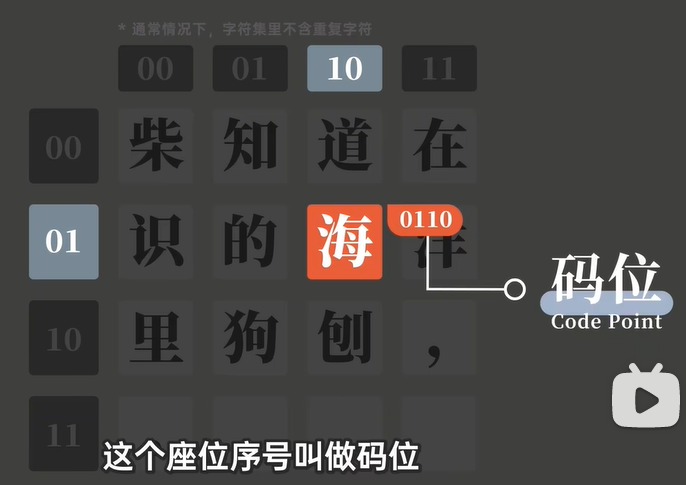
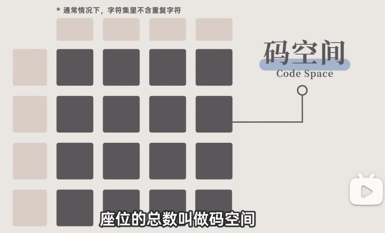
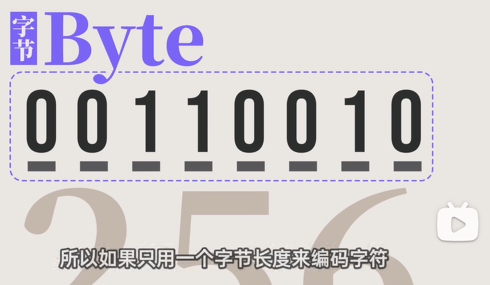
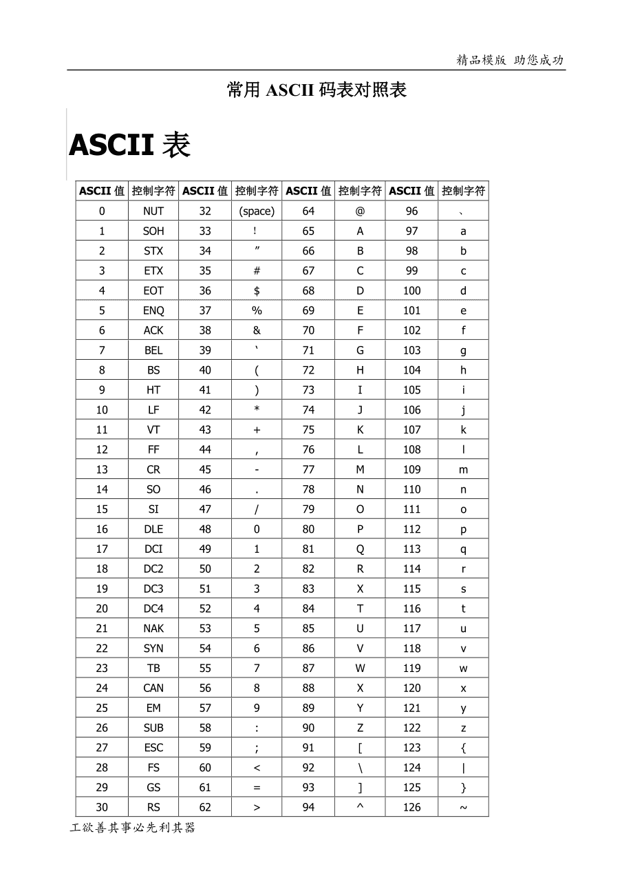
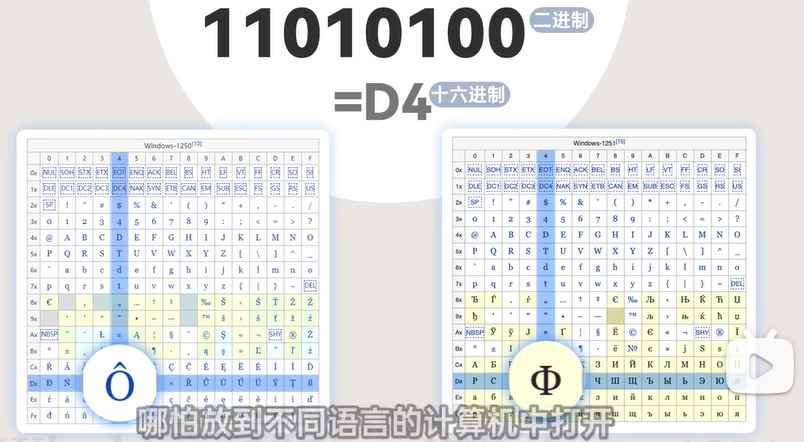
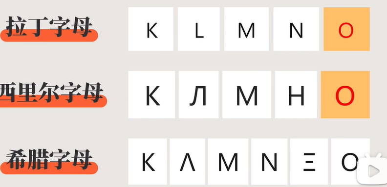
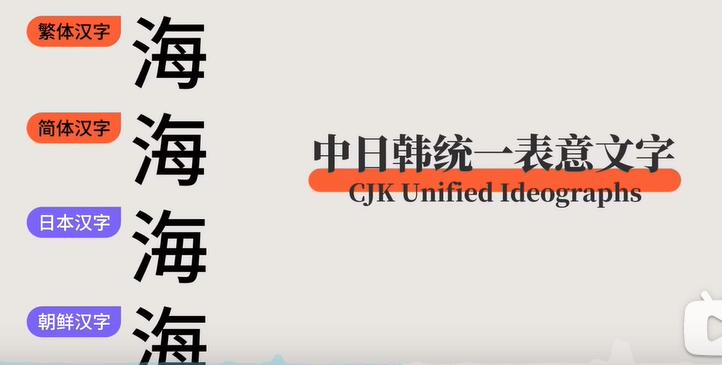
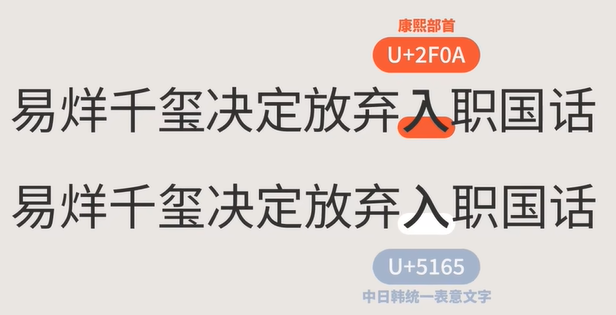

# 中文乱码出现原理

## 笔记 ~~叠甲（bushi）~~使用声明

​	该笔记于Typora中写出，可以使用Typora打开使用，相关配图符合基本图片相对地址引用，如果下载时没有对应软件，可将内容复制到语雀中进行查看（相关的图就请和括号内的地址一一对应）。

​	笔记内的声明是基于视频中的内容加上我自己的部分理解，故可能有部分文本描述不当，有关此部分，请坚定自己的想法。如果能联系我那就更好了（通过b站私信说明即可）。

## 笔记对应的视频

​	**锟斤拷�⊠是怎样炼成的——中文显示“⼊”门指南【柴知道】**

BV1cB4y177QR

https://www.bilibili.com/video/BV1cB4y177QR/?spm_id_from=333.851.b_7265636f6d6d656e64.3&vd_source=a7225b293f719b91850f380d8d7ccc5f

## 基础

电脑显示字有三个重要的概念

* 字符		单个文字、标点符号	
* 字符集             多个字符的集合
* 字符编码          计算机从0-1转换的规则

### 字符编码原理

​	将字符集中的文字按一定顺序进行排序，把座位的行和列使用二进制数字进行标记。单个字符所在的空间成为**码位**。

​	字符集所在的空间称为**码空间**：

​	码空间越大，字符集越大。

​	在现实世界中，计算机存储的基本单元是字节（Byte），一个字节由8个二进制位组成，即8个比特（bit），每个比特有0和1两个状态，那么一位有256个不同的状态。如果用1字节长度用来编码字符，即使用8个0或1表示一个字的话，那么这个字符集可以容纳256个字符。

## ASCII的发展

### 初始发展及扩展字符集的乱象

​	1968年，美国搞出了ASCII（美国信息交换代码），即我们所熟悉的ASCII表，用来规定常用字母、数字和部分计算机功能键（ESC、空格等）的**二进制表示**。

​	上面的ASCII表中，基础字符已经表达完了后还剩下近一半的位置处于空置状态。世界上不是只有美国一个国家，文字也不是只有英文，在美国提出ASCII后，后续其他国家相继在ASCII的基础上提出了EASCII（ASCII扩展）。到这里问题就来了，各国提出的EASCII标准不同，且不同国家的EASCII互不兼容，在不同国家的计算机上相同的二进制表达通常表现的是不同的文字。

### 有关汉字的字符集

​	而当计算机发展到中日韩这边的时候，就有了个更复杂的问题——汉字，汉字的历史源远流长，汉字总数又数不胜数。

​	单说我国于1980年发布的GB 2312-80信息交换用汉字编码字符集 基本集中就包括了6763个常用简体汉字，以及一些标点、符号、数字、拉丁字母等。到这里我们可以想象得到，仅使用一个字符表示汉字根本不够用，所以GB 2312用两个字节来表示一个字符，即理论上该字符集中存在$2^{16}$个字符。

>有关标点符号
>
>​	全角	两个字节编码的
>
>​	半角	一个字节编码的

​	上面也说了，GB 2312-80中只是收录了最基本的汉字，涉及到一些人名中的常用字大部分都没有收录。同时使用汉字的国家也有许多，比如中国大陆地区使用简体汉字居多，台湾地区、新加坡等地使用繁体汉字居多，日本有日本汉字，韩国有韩国汉字，同样的，字符编码规则之间的兼容性同样很差。

​	对于中文字符编码集来说，微软也被这些不同的字符编码集很是头疼，自行扩展了GB 2312字符集，加入了部分繁体汉字，这份扩展后的字符集后来就成了 **汉字内码扩展规范*（GBK）*** ，这个汉字内扩展规范并不是国家规范，只是一个技术规范指导性文件。且对BGK的缝缝补补导致了现在时不时还有乱码出现。

### 万国码

​	但是多个字符集的使用还是有些不方便，故将多个字符集集合成**Unicode码**，就是我们时常能听到的“万国码”。

​	万国码是以书写系统进行字符的分类和收录。

* 拉丁字母

* 中日韩统一表意文字(CJK Unified Ideographs)

​	当然上面只是进行了一个简单说明，里面的东西比较多，具体的可以自己找相关文件进行查看。

​	文字收录过程中，因为考虑到兼容性问题，故尽管有部分字符长相差不多甚至是一模一样，但还是使用了**不同的**码位对他们进行收录。

​	而对于汉字来说，部分字符在各地都有使用，只是长相略有区别，Unicode为了节省码位，让他们共用一个码位。

​	上面的想法挺好的，可也为字符的使用埋下了坑

#### 文字的显示小花招

* 钓鱼网站

  有的时候看一个网址的url是没有问题的，但是进入相关网站就不是对应的官网，这里就涉及到了字符集的操作。

  比如同样是a，英文中的a和希伯来字母的a，尽管都是a，但他们的码值是完全不同的。

  

* 热搜操作

  Unicode中收录了214个康熙部首，收录他们的原因是方便词典和输入法给汉字排序，并和中国台湾的中文标准交换码相互兼容。在一般情况下，康熙部首并不容易被人所输出。

  但你要知道，总有些人有些坏心思，就比如降热搜的操作方法实际上就和这些康熙部首有关。使用康熙部首“⼊”替换掉正常的“入”。

  

#### Unicode的扩展

​	现如今Unicode编码不断扩充，已经包括多个字符，就我们生活所接触到的字符，生僻字，emoji表情都被收录进了Unicode中。甚至为了部分国家、地区甚至是公司提供了私用区。

​	比如说苹果公司将自己的logo放入了私用区，只有mac，ios等苹果曹祖系统才能看见这个字符，windows拒绝显示。

​	Unicode的本质是将不同的编码进行统一集成，故存在多种编码方式，如UTF-8，	GBK，UTF-32，而一旦输入编码方式和查看编码方式不一致，就会导致乱码的出现。

# 我国规定及如今现状

**所有正式文件所采用的编码方式统一为utf-8**

​	这一点实际上不用太担心，如果不对编码方式进行更深层次的研究，如数据库中的字符集存储方式设定等，完全不用担心这个问题。现在微软对记事本的输入和查看字符编码方式都改为了utf-8，各大厂商也对他们的产品的字符编码方式进行了统一的优化。

# 乱码复现及原理

## 复现锟斤拷

​	如果你想手动复现乱码，可以进行以下操作	

* 在win7的记事本中随便输入一些文字（默认设置下）
* 将txt文件发送给别人，确认别人看到的是乱码
* 让他随便改改，保存后给win7设备发回来
* 查看 ’锟斤拷‘ 乱码

## 锟斤拷原理

​	win7笔记本的默认输入字符编码方式是GBK，而默认的查看字符编码方式是utf-8,在Unicode中，不同编码方式出现的无法找到对应字符会使用一个特别的符号来替换。

​	而在GBK中，连续两个这种符号所对应的字符正是锟斤拷

